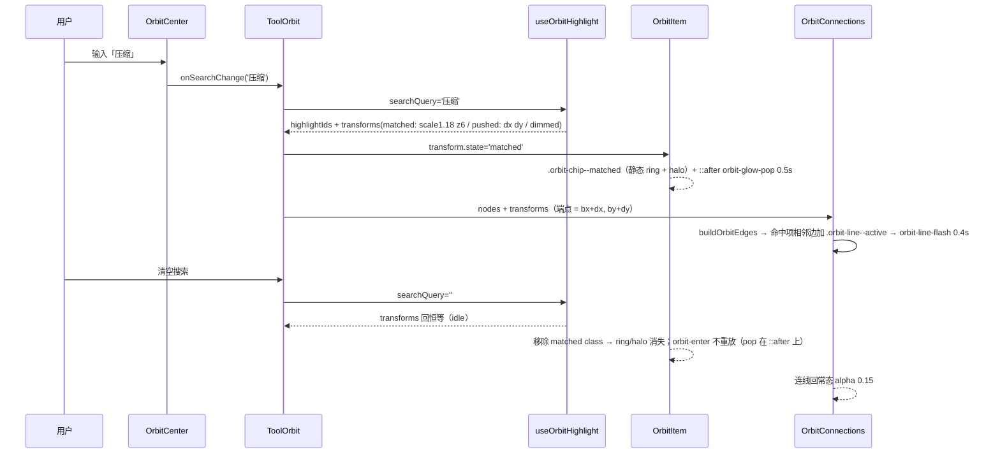
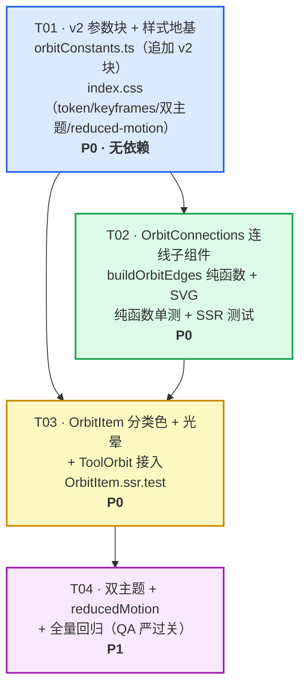

# v2 视觉调优规格 —— 「工具环绕搜索框」装饰层升级

- **项目**：普通日常工具箱（React18 + TS + Vite6 + Tailwind3 + Zustand，HashRouter，零后端 / 离线可用）
- **架构师**：高见远（Bob）
- **版本**：v2.0（基于 v1 commit 91d0c51 之后的现状）
- **目标**：解决「视觉太像数据网格 —— 方块整齐对齐、缺乏灵动气质」的用户反馈
- **铁律**：**保留方块**（不变形、不旋转、不偏移、不改大小、保留对齐）；只改**装饰层**（分类填色 / 高亮光晕 / 卡片间细光线）；主体结构（布局算法、内核、hooks、Home 替换逻辑）一概不动

---

## 0. 现状核实（已 Read 逐一确认）

| 项 | 核实结果 |
|---|---|
| 三层 DOM | `OrbitItem.tsx`：`.orbit-item`（定位 + inline transform）→ `.orbit-item__float`（idle 浮动）→ `.orbit-chip`（按钮，class 驱动发光/描边/暗淡） |
| chip 底色 | `index.css` `.orbit-chip { background: var(--card); border: 1px solid var(--border); }` —— 统一灰卡片，正是「数据网格感」来源 |
| matched 态 | `.orbit-chip--matched { border-color: var(--accent); box-shadow: 0 0 20px rgb(var(--accent-rgb)/0.35); }`，配合 transform `scale 1.18 + z=6`（排斥内核产出） |
| 分类数据 | `categories.ts` 5 类无 color 字段；`ToolGrid.tsx` 有 `categoryColors`（gradient class），`orbitConstants.ts` 的 `CATEGORY_COLORS` 与之**已对齐**（v1 T02 已提升导出） |
| 装饰层 | `OrbitRingsLayer.tsx`：椭圆引导线 + 分类小标签，`pointer-events:none`，z-0；**本文件不在 v2 改动名单内** |
| 容器 | `ToolOrbit.tsx`：`useStageMetrics → useOrbitLayout → useOrbitHighlight`，`transforms` 已在作用域内，可直接传给连线层 |
| 主题 | `index.css` `:root` / `html.light` 双份 CSS 变量 + `-rgb` 通道副本；`prefers-reduced-motion` 全局块已存在（第 600~632 行），v2 只需**追加**规则 |
| 性能 | 排斥内核 <0.1ms；66 项 React.memo；`will-change` 仅搜索期挂载；z 预算 ≤20（0/1/2/6/10） |

**结论**：v2 改动面收敛为 **5 个源文件**（orbitConstants.ts / index.css / OrbitItem.tsx / OrbitConnections.tsx(新) / ToolOrbit.tsx）+ 3 个测试文件。内核（src/lib/orbit/layout.ts / ellipse.ts / repulsion.ts / types.ts）、hooks、Home.tsx、ToolGrid.tsx 全部不动。

---

## 1. 需主理人拍板的决策点（都给了默认值，Engineer 可先按默认开工）

| # | 决策点 | 方案 A（推荐） | 方案 B | 默认 |
|---|---|---|---|---|
| D1 | 高亮光晕动画 | **单次弹一下**：0.5s 一次 pop（box-shadow ring → 24px 光晕 → 回落），多个命中项不持续占合成器 | 1.2s 循环呼吸（infinite alternate，18↔24px），更有「霓虹感」但 66 项内多个命中会持续占用合成器 | **A** |
| D2 | 连线颜色 | **分类色相**（每线取发送方分类 hue，簇内自成色网，与分类填色呼应） | 统一 accent（电路感更强，但与彩色卡片联动弱） | **分类色相** |
| D3 | 连线脉冲结束 | **回落到常态**（0.4s 闪一下即回，`orbit-line-flash` 单向） | 停留微亮（matched 期间保持 alpha 0.35） | **回落** |
| D4 | 跨环径向线 | **默认关**（`crossRingSpoke: false`，feature flag 留通路） | 开（每节点连上一环最近节点，网状但更杂、可能横穿中心区） | **关** |

> 若主理人不回复，Engineer 按默认 A/A/回落/关 实现即可；D1~D4 全部是 `orbitConstants.ts` v2 块里的常量/开关，后改成本极低。

---

## 2. 实现方案（Implementation Approach）

### 2.1 分类色填充背景（chip 层填色）

**机制**：`.orbit-chip` 追加分类 class `orbit-chip--cat-{id}`（id ∈ everyday/finance/health/image/fun），背景从 `var(--card)` 切换为**分类色相派生**的半透明色。颜色全部走 CSS 变量，不硬编码 hex，深/浅双主题各一份覆盖。

- 色相 `--orbit-cat-{id}-h`（5 个）+ 共享 `--orbit-cat-s` / `--orbit-cat-l`（浅色主题覆盖 L，提对比）
- 背景 alpha：`--orbit-chip-bg-alpha: 0.72`（落在主理人给的 0.6~0.85 区间，默认 0.72；嫌花可下调）
- 边框 alpha：`--orbit-chip-border-alpha: 0.45`（深）/ `0.55`（浅）
- **规则顺序陷阱**：`.orbit-chip--cat-*` 必须写在 `.orbit-chip--matched / --pushed / --dimmed` **之前**（同级选择器后者胜，保证 matched 的 accent 边框、dimmed 的 border 能盖住分类边框）

**色板（HSL 通道值）**：

| 分类 | 语义 | H | S（共享） | L 深色 | L 浅色 |
|---|---|---|---|---|---|
| everyday | 日常淡绿 | 152 | 60% | 58% | 88% |
| finance | 财务淡金 | 42 | 60% | 58% | 88% |
| health | 健康淡蓝 | 205 | 60% | 58% | 88% |
| image | 图片淡紫 | 265 | 60% | 58% | 88% |
| fun | 趣味淡粉 | 330 | 60% | 58% | 88% |

（深色取中亮度的半透明叠在 `--bg` 上呈「淡而有色」；浅色取高亮度的 pastel 叠在浅底上仍淡雅。S/L 是共享旋钮，如需某一类更艳可加 `--orbit-cat-{id}-s/l` 单项覆盖。）

**OrbitItem.tsx 改动量 = 1 行**（chip className 追加 `orbit-chip--cat-${tool.category}`），`tool` 已在 props 中，**无需新 props、无需动 React.memo 比较器**（比较器不比较 tool，tool 引用本就不变）。

### 2.2 高亮光晕（matched 周围一圈光）

**触发**：`transform.state === 'matched'`（searchQuery 命中，由 useOrbitHighlight 产出，不改该 hook）。

**静态 ring（两种方案共享、reducedMotion 也保留）**——升级 `.orbit-chip--matched`：
```css
.orbit-chip--matched {
  border-color: var(--accent);
  box-shadow:
    0 0 0 var(--orbit-ring-width) rgb(var(--accent-rgb) / var(--orbit-ring-alpha)),  /* 2px 锐利 ring */
    0 0 var(--orbit-halo-radius) rgb(var(--accent-rgb) / var(--orbit-halo-alpha));   /* 18px 微扩散 */
}
```
- `--orbit-ring-width: 2px`、`--orbit-ring-alpha: 0.9`、`--orbit-halo-radius: 18px`、`--orbit-halo-alpha: 0.35`
- **强度约束**：光晕最大扩散 `--orbit-glow-pop-halo: 24px` < 排斥 `maxOffset: 28px`，配合邻居被推开 + matched 提层 z=6，**不会盖住邻居**。

**动画（方案 A：单次弹一下，推荐）**——放在 `.orbit-chip--matched::after` **伪元素**上，绝不放在 `.orbit-chip` 上：
```css
.orbit-chip--matched::after {
  content: '';
  position: absolute;
  inset: -2px;
  border-radius: inherit;
  pointer-events: none;
  animation: orbit-glow-pop var(--orbit-glow-pop-dur) var(--orbit-glow-ease) both;
}
@keyframes orbit-glow-pop {
  0%   { box-shadow: 0 0 0 0 rgb(var(--accent-rgb) / 0.6); }
  40%  { box-shadow: 0 0 var(--orbit-glow-pop-halo) 0 rgb(var(--accent-rgb) / 0.35); }
  100% { box-shadow: 0 0 0 0 rgb(var(--accent-rgb) / 0); }
}
```
- `--orbit-glow-pop-dur: 500ms`、`--orbit-glow-ease: cubic-bezier(0.22, 1, 0.36, 1)`（快进慢出）
- **为什么用 ::after**：`.orbit-chip` 已有 `animation: orbit-enter`（入场）。若把 pop 动画直接写在 `.orbit-chip--matched` 上，会**替换** animation 列表；用户清空搜索时 matched class 移除 → orbit-enter 被重新挂载 → 全部命中项闪烁重放入场。伪元素是独立动画载体，彻底规避这个回归。
- **方案 B（循环呼吸）**：`animation: orbit-glow-breathe 1.2s ease-in-out infinite;`，keyframe 在 18px↔24px 光晕间往复。同放 ::after。
- **reducedMotion**：全局块已 `*::before/::after { animation-duration: 0.01ms }`，再加一条 `.orbit-chip--matched::after { display: none; }` —— 静态 ring 保留、光晕动画消失。

**与 v1 叠加**：matched 的 `scale 1.18 + z=6` 来自排斥内核（不动）；ring/光晕是 box-shadow，随父级 scale 一起缩放，互不冲突。

### 2.3 卡片间细光线（OrbitConnections SVG 层）

**形态**：极细线（1px、alpha 0.15），常态静态；某工具命中时，与它相邻的连线**短暂加粗 + 发光（0.4s）**，像电路连通。

**拓扑规则**（纯函数 `buildOrbitEdges`，零 React）：
- 按 `ringIndex` 分组、环内按 `indexInRing` 排序；
- **同环下一个（首尾闭环）**：`node[i] → node[i+1]`，最后一项回连第一项；
- **跳过跨分类段**（`skipCrossSegment: true` 默认）：当发送方与接收方 `categoryId` 不同时跳过 → 每分类簇内部连成**同色弧**，不横穿 6° 分类缺口、不压分类小标签；
- **跨环 spoke**（`crossRingSpoke: false` 默认关）：每节点连到 `ringIndex+1` 环上欧氏距离最近节点；
- 每条边颜色 = **发送方分类 hue**（D2 默认），`categoryId = from.categoryId`；
- 环内节点数 < 2 不产生边（避免零长度自连）。

**渲染**：
- 新文件 `src/components/orbit/OrbitConnections.tsx`，默认导出 SVG 子组件；`buildOrbitEdges` 作为**导出纯函数**同文件（供 node 环境单测）。
- SVG `position:absolute; inset:0; pointer-events:none; overflow:visible;`，`width/height = stage`，**viewBox 以舞台中心为原点**（`-w/2 -h/2 w h`）→ `bx/by` 直接可用（§8.1 坐标系约定零转换）。
- 端点 = **静态落位 + 排斥位移**：`x = bx + transforms[id].dx`、`y = by + transforms[id].dy` → 搜索时连线跟随卡片移动，**不断线**。
- 激活判定：`fromT.state === 'matched' || toT.state === 'matched'`（命中项的出边 + 前驱入边同时点亮 = 与所有邻居连通）。
- z 轴：无 z-index（SVG 兄弟节点自然在 items 之下、ring 引导线附近），**不新增预算**；pointer-events:none 不挡点击。

```css
.orbit-line {
  fill: none;
  stroke: hsl(var(--orbit-cat-everyday-h) var(--orbit-cat-s) var(--orbit-cat-l));
  stroke-width: 1px;
  stroke-opacity: var(--orbit-line-base-alpha);   /* 0.15 */
}
.orbit-line--cat-finance { stroke: hsl(var(--orbit-cat-finance-h) var(--orbit-cat-s) var(--orbit-cat-l)); }
/* …其余 3 类同理… */
.orbit-line--active { animation: orbit-line-flash var(--orbit-line-flash-dur) ease-out both; }
@keyframes orbit-line-flash {
  0%   { stroke-opacity: var(--orbit-line-base-alpha);  stroke-width: 1px; }
  30%  { stroke-opacity: var(--orbit-line-active-alpha); stroke-width: var(--orbit-line-active-width); }
  100% { stroke-opacity: var(--orbit-line-base-alpha);  stroke-width: 1px; }
}
```
- `--orbit-line-flash-dur: 400ms`、`--orbit-line-active-alpha: 0.6`、`--orbit-line-active-width: 3px`、`--orbit-line-settle-alpha: 0.35`
- 关键：**alpha 由 `stroke-opacity` 承担**（可动画），stroke 颜色本身不带 alpha —— 避免「颜色 alpha × stroke-opacity 叠加」把亮度吃没。
- **reducedMotion**：`@media (prefers-reduced-motion: reduce)` 里追加 `.orbit-line--active { animation: none !important; stroke-opacity: 0.35; stroke-width: 1px; }` → 静态微亮、无脉冲。

**接入**：`ToolOrbit.tsx` 在 `ready && stage.width > 0` 分支内、`<OrbitRingsLayer>` 之前渲染：
```tsx
<OrbitConnections nodes={layout.nodes} transforms={transforms} stage={stage} />
```
`transforms` / `stage` / `layout.nodes` 都已在 ToolOrbit 作用域内，**不需要改任何 hook**。

### 2.4 明确的不动项（铁律）

| 类别 | 文件 / 逻辑 | 状态 |
|---|---|---|
| 布局内核 | `src/lib/orbit/layout.ts`、`ellipse.ts`、`repulsion.ts`、`types.ts` | **一行不动** |
| Hooks | `useStageMetrics.ts`、`useOrbitLayout.ts`、`useOrbitHighlight.ts` | **一行不动** |
| 页面 | `src/pages/Home.tsx`、`ToolGrid.tsx`（含其 `categoryColors`） | **一行不动** |
| 其它 | 所有非 orbit 文件 | **不动** |
| z 预算 | 0/1/2/6/10，硬上限 20；不触碰 30/40/50 | **不变** |
| 性能红线 | 只改 transform/opacity；will-change 仅搜索期；React.memo；量化 40px 桶 | **不变** |
| reducedMotion | 全局兜底保留，v2 仅**追加**两条规则 | **追加** |

---

## 3. 文件清单（File List）

| 相对路径 | 类型 | 变更 | 职责 |
|---|---|---|---|
| `src/lib/orbit/orbitConstants.ts` | 纯 TS | **修改（仅末尾追加 v2 块）** | v2 全部可调参数：`CATEGORY_CHIP_HUE` / `ENABLE_CATEGORY_CHIP_BG` / `ORBIT_GLOW_V2` / `ORBIT_LINES_V2` |
| `src/index.css` | CSS | **修改** | `:root` 追加 `--orbit-cat-*` / `--orbit-ring-*` / `--orbit-halo-*` / `--orbit-glow-*` / `--orbit-line-*`；`html.light` 追加浅色覆盖；新增 `.orbit-chip--cat-*` / `.orbit-chip--matched` 升级 + `::after` / `.orbit-line*` 规则；新增 `@keyframes orbit-glow-pop` / `orbit-line-flash`（方案 B 另加 `orbit-glow-breathe`）；reduced-motion 块追加两条 |
| `src/components/orbit/OrbitItem.tsx` | 组件 | **修改（1 行）** | chip className 追加 `orbit-chip--cat-${tool.category}`；光晕由 CSS 承担 |
| `src/components/orbit/OrbitConnections.tsx` | 组件 | **新建** | 导出纯函数 `buildOrbitEdges` + 默认导出 SVG 连线子组件 |
| `src/components/orbit/ToolOrbit.tsx` | 组件 | **修改（~5 行）** | import + 渲染 `<OrbitConnections nodes transforms stage />` |
| `src/components/orbit/__tests__/OrbitConnections.test.ts` | 测试 | **新建**（node env） | `buildOrbitEdges` 纯函数断言 |
| `src/components/orbit/__tests__/OrbitConnections.ssr.test.tsx` | 测试 | **新建**（SSR） | `renderToStaticMarkup` 渲染不抛错、line 数量正确 |
| `src/components/orbit/__tests__/OrbitItem.ssr.test.tsx` | 测试 | **新建**（SSR） | chip class 含 `orbit-chip--cat-{id}`、matched class 正确 |

**明确不动**：`src/lib/orbit/{types,layout,ellipse,repulsion}.ts`、`src/hooks/*`、`src/pages/Home.tsx`、`src/components/ToolGrid.tsx`、`src/components/orbit/OrbitRingsLayer.tsx`、`src/components/orbit/OrbitCenter.tsx`、其它非 orbit 文件。

---

## 4. 参数表（orbitConstants.ts 新增 v2 块，旧参数一行不动）

### 4.1 分类色（index.css 为主，TS hue 表与其成对）

| CSS 变量 | 深色 | 浅色（html.light） | 说明 |
|---|---|---|---|
| `--orbit-cat-everyday-h` | 152 | 152 | 淡绿 |
| `--orbit-cat-finance-h` | 42 | 42 | 淡金 |
| `--orbit-cat-health-h` | 205 | 205 | 淡蓝 |
| `--orbit-cat-image-h` | 265 | 265 | 淡紫 |
| `--orbit-cat-fun-h` | 330 | 330 | 淡粉 |
| `--orbit-cat-s` | 60% | 55% | 共享饱和（可单项覆盖） |
| `--orbit-cat-l` | 58% | 88% | 共享亮度（浅色提亮成 pastel） |
| `--orbit-chip-bg-alpha` | 0.72 | 0.72 | 背景透明度（0.6~0.85 区间） |
| `--orbit-chip-border-alpha` | 0.45 | 0.55 | 边框透明度（浅色需更高对比） |

TS：`CATEGORY_CHIP_HUE: Record<string, number>`（5 项，值 = 上表 H）；`ENABLE_CATEGORY_CHIP_BG = true`。

### 4.2 高亮光晕

| 参数（CSS var / TS） | 值 | 说明 |
|---|---|---|
| `--orbit-ring-width` / `ringWidth` | 2px / 2 | ring 厚度 |
| `--orbit-ring-alpha` / `ringAlpha` | 0.9 / 0.9 | ring 不透明度（accent） |
| `--orbit-halo-radius` / `haloRadius` | 18px / 18 | 静态光晕扩散半径 |
| `--orbit-halo-alpha` / `haloAlpha` | 0.35 / 0.35 | 静态光晕不透明度 |
| `--orbit-glow-pop-halo` / `popHalo` | 24px / 24 | pop 最大扩散（< 28px 排斥位移） |
| `--orbit-glow-pop-dur` / `popDuration` | 500ms / 500 | 单次弹一下时长（方案 A） |
| `--orbit-glow-ease` / `popEase` | `cubic-bezier(0.22, 1, 0.36, 1)` | 快进慢出 |
| `breathDuration`（TS） | 1200 | 方案 B 循环呼吸周期（若选 B） |

### 4.3 卡片间细光线

| 参数（CSS var / TS） | 值 | 说明 |
|---|---|---|
| `--orbit-line-base-alpha` / `baseAlpha` | 0.15 / 0.15 | 常态不透明度 |
| `--orbit-line-active-alpha` / `activeAlpha` | 0.6 / 0.6 | 高亮发光不透明度 |
| `--orbit-line-active-width` / `activeWidth` | 3px / 3 | 高亮加粗宽度 |
| `--orbit-line-flash-dur` / `flashDuration` | 400ms / 400 | 电路连通脉冲时长 |
| `--orbit-line-settle-alpha` / `settleAlpha` | 0.35 / 0.35 | reducedMotion 静态微亮 |
| `sameRingNext`（TS） | true | 同环下一个（首尾闭环） |
| `skipCrossSegment`（TS） | true | 跳过跨分类段连线 |
| `crossRingSpoke`（TS） | false | 跨环径向线（默认关） |
| `colorSource`（TS） | `'category'` | 色相来源；可改 `'accent'` |

> 与 v1 的约定一致（§8.2）：**CSS 变量与 TS 常量成对存在**，改一处必须改另一处。

---

## 5. 数据结构与接口（Data Structures and Interfaces）

```mermaid
classDiagram
  class OrbitConstantsV2 {
    +CATEGORY_CHIP_HUE: Record~string, number~
    +ENABLE_CATEGORY_CHIP_BG: boolean
    +ORBIT_GLOW_V2: object
    +ORBIT_LINES_V2: object
  }
  class OrbitEdge {
    +key: string
    +from: OrbitNode
    +to: OrbitNode
    +categoryId: string
  }
  class buildOrbitEdges {
    +buildOrbitEdges(nodes, opts?) OrbitEdge[]
  }
  class OrbitConnections {
    +nodes: readonly OrbitNode[]
    +transforms: Record~string, OrbitTransform~
    +stage: StageBox
    +render() svg
  }
  class OrbitItem {
    +node: OrbitNode
    +tool: ToolRecord
    +transform: OrbitTransform
    +itemW: number
    +itemH: number
    +enterIndex: number
    +interacting: boolean
    +onActivate: fn
    +render() .orbit-item > .orbit-item__float > .orbit-chip--cat-{id}
  }
  class ToolOrbit {
    +tools: ToolRecord[]
    +searchQuery: string
    +onSearchChange: fn
    +searchInputRef: RefObject
    +activeCategoryId: string | null
    +render() OrbitConnections + OrbitRingsLayer + OrbitCenter
  }
  OrbitConnections --> buildOrbitEdges : 计算边
  OrbitConnections --> OrbitEdge : 渲染 line
  ToolOrbit --> OrbitConnections : nodes / transforms / stage
  ToolOrbit --> OrbitItem : transform / tool
  OrbitConstantsV2 --> OrbitConnections : 参数
  OrbitConstantsV2 --> OrbitItem : 参数
```

**`buildOrbitEdges` 签名（纯函数，零 React / 零 DOM）**：
```ts
export interface OrbitEdgesOptions {
  sameRingNext?: boolean;     // 默认 true
  skipCrossSegment?: boolean; // 默认 true
  crossRingSpoke?: boolean;   // 默认 false
}
export function buildOrbitEdges(
  nodes: readonly OrbitNode[],
  opts?: OrbitEdgesOptions,
): OrbitEdge[];
```

**OrbitConnections Props**：
```ts
export interface OrbitConnectionsProps {
  nodes: readonly OrbitNode[];                 // useOrbitLayout 产出（静态落位）
  transforms: Record<string, OrbitTransform>;  // useOrbitHighlight 产出（dx/dy/state）
  stage: StageBox;                             // 量化后的舞台尺寸，viewBox 用
}
```

---

## 6. 程序调用流程（Program Call Flow）



---

## 7. 任务列表（按依赖顺序，1 个工程师一轮可做完）

> 说明：v2 改动面本身只有 5 个源文件，无法套用「每任务 ≥3 文件」的通用规则；本表按「参数+样式地基 → 连线组件 → 发光接入+测试」三层分组，避免单文件任务与碎片化。

### T01 · v2 参数块 + 样式地基（P0，无依赖）

- **Source Files**：
  - `src/lib/orbit/orbitConstants.ts`（修改：**仅末尾追加** §4 的 v2 块，旧参数一行不动）
  - `src/index.css`（修改：`:root` 追加全部 `--orbit-*` v2 token；新增 `.orbit-chip--cat-*`（**置于状态 class 之前**）、`.orbit-chip--matched` 升级 + `::after`、`.orbit-line*` 规则；新增 `@keyframes orbit-glow-pop`、`orbit-line-flash`（方案 B 另加 `orbit-glow-breathe`）；`html.light` 追加浅色覆盖；reduced-motion 块追加 `.orbit-chip--matched::after { display:none }` 与 `.orbit-line--active { animation:none; stroke-opacity:.35 }`）
- **要点**：
  - CSS 变量与 TS 常量**成对**（§8.2 硬约定），数值一一对应；
  - 颜色只用 CSS 变量（HSL 通道 / accent-rgb），**不硬编码 hex**；
  - `.orbit-chip--cat-*` 的 border 规则必须写在 matched/pushed/dimmed 之前；
  - pop 动画放 `::after`，**严禁**放 `.orbit-chip`（防 orbit-enter 重放回归）。
- **验收**：`npm run check` 通过；`npm run test` 既有全绿。

### T02 · OrbitConnections 连线子组件 + 纯函数 + 单测（P0，依赖 T01）

- **Source Files**：
  - `src/components/orbit/OrbitConnections.tsx`（新建：导出 `buildOrbitEdges` 纯函数 + 默认导出 SVG 子组件，`useMemo` 缓存边集）
  - `src/components/orbit/__tests__/OrbitConnections.test.ts`（新建，`// @vitest-environment node`：纯函数断言）
  - `src/components/orbit/__tests__/OrbitConnections.ssr.test.tsx`（新建：`renderToStaticMarkup` 渲染不抛错、line 数量/class 正确）
- **要点**：
  - viewBox 以舞台中心为原点（`-w/2 -h/2 w h`），`bx/by` 零转换；
  - 端点 = `bx + dx` / `by + dy`（跟随排斥位移，不断线）；
  - 激活 = 任一端点 `state === 'matched'`；环内 <2 节点不产边；
  - SVG `pointer-events:none; overflow:visible`，不设 z-index（不新增预算）。
- **单测断言**：
  1. 3 节点同环 → 3 条边（i→i+1 闭环）；
  2. 跨分类段（不同 categoryId）→ 该边被跳过；
  3. `crossRingSpoke: true` → 每节点连到下一环最近节点；默认 false → 无跨环边；
  4. `transforms` 带 `dx:10` → 端点 x = `bx+10`；
  5. 命中任一端点 → 该 line 含 `orbit-line--active`。
- **验收**：`npm run test` 新增用例全绿。

### T03 · OrbitItem 分类色 + 光晕 + ToolOrbit 接入 + 测试（P0，依赖 T01、T02）

- **Source Files**：
  - `src/components/orbit/OrbitItem.tsx`（修改：chip className 追加 `orbit-chip--cat-${tool.category}`，其余不动）
  - `src/components/orbit/ToolOrbit.tsx`（修改：import OrbitConnections；ready 分支内、`<OrbitRingsLayer>` 前渲染 `<OrbitConnections nodes={layout.nodes} transforms={transforms} stage={stage} />`）
  - `src/components/orbit/__tests__/OrbitItem.ssr.test.tsx`（新建：直接渲染 OrbitItem，断言 chip class 含分类 class / matched class / 不抛错）
- **要点**：
  - OrbitItem 只加一个 class，**不动** memo 比较器、不动三层 DOM 结构、不动 inline transform；
  - ToolOrbit 只加 import + 一行渲染，**不动**任何 hook 调用与顺序。
- **验收**：`npm run check` / `npm run test` / `npm run build` 全绿；`npm run dev` 目视：搜索命中 → ring+光晕 pop + 相邻连线脉冲；清空 → 无动画残留、无闪烁。

### T04 · 双主题 + reducedMotion + 全量回归（P1，依赖 T03）

- **Source Files**：
  - `src/index.css`（若 T01 未一次做全：核对 `html.light` 覆盖与 reduced-motion 追加是否到位）
  - 全量验证：`npm run check` / `npm run build` / `npm run test`
- **要点**：按 §9 QA 清单执行；重点看浅色主题 pastel 对比、reducedMotion 下静态 ring / 静态微亮、清空搜索无 orbit-enter 重放。
- **验收**：QA 严过关一轮通过。

---

## 8. 共享知识（Shared Knowledge）—— v2 跨文件硬约定

1. **颜色单源**：分类色相只定义在 `index.css` 的 `--orbit-cat-{id}-h`；`orbitConstants.ts` 的 `CATEGORY_CHIP_HUE` 是**成对镜像**（§8.2），只供测试/文档，改一处必须改另一处。**禁止硬编码 hex**；要透明度一律走 CSS 变量或 `rgb(var(--accent-rgb) / x)`。
2. **规则顺序**：`.orbit-chip--cat-*` 的 border 规则必须写在 `.orbit-chip--matched / --pushed / --dimmed` **之前**（同级选择器后者胜）。
3. **动画载体**：chip 上的 pop 光晕**只能**放 `.orbit-chip--matched::after`，**严禁**放 `.orbit-chip` —— 否则清空搜索会重放 `orbit-enter`（全量闪烁回归）。
4. **连线 alpha**：用 `stroke-opacity` 控制（可动画），stroke 颜色本身不带 alpha，避免叠加吃亮度。
5. **SVG 坐标系**：viewBox 以舞台中心为原点，`bx/by` 零转换；端点加 `dx/dy` 跟随排斥。
6. **z 预算**：连线层无 z-index、pointer-events:none，不新增预算；全 orbit 仍 ≤20（0/1/2/6/10），绝不触碰 30/40/50。
7. **reducedMotion**：全局块**追加**两条（`.orbit-chip--matched::after { display:none }`、`.orbit-line--active { animation:none; stroke-opacity:.35 }`），**不改**既有规则；静态 ring 保留。
8. **性能红线不变**：只改 transform/opacity；连线端点是 SVG 属性，仅 query/layout 变化时重算；`will-change` 仍只挂搜索期。
9. **不动清单**：src/lib/orbit/*（types/layout/ellipse/repulsion）、src/hooks/*、src/pages/Home.tsx、src/components/ToolGrid.tsx、OrbitRingsLayer.tsx、OrbitCenter.tsx、其它非 orbit 文件 —— **一行不动**。
10. **不加 npm 依赖**。

---

## 9. 任务依赖图（Task Dependency Graph）



**关键路径**：T01 → T02/T03 → T04。T02 与 T03 相互独立（仅 T03 需要 T02 的文件存在才能接线），工程师一轮内按 T01 → T02 → T03 → T04 顺序执行即可。

---

## 10. QA 严过关预想（智能路由判定）

本次**纯装饰、零算法改动**，QA 重点不是重测内核数值，而是：

1. `npm run check`（tsc 零报错）
2. `npm run build`（vite build 成功）
3. `npm run test`（全量：既有 orbit 测试 + 新增 buildOrbitEdges / SSR 用例全绿）
4. 视觉抽查（dev server，深/浅双主题）：
   - 5 类卡片底色可辨、淡雅不花（alpha 0.72，若嫌花降 `--orbit-chip-bg-alpha`）；
   - 搜索命中 → 2px ring + 18px 光晕 + 0.5s pop；相邻连线 0.4s 加粗发光；匹配项 scale 1.18 与 z=6 正常；
   - 清空搜索 → 全部回静态，**无 orbit-enter 重放闪烁**（重点回归点）；
   - DevTools 模拟 `prefers-reduced-motion: reduce` → 静态 ring 保留、无光晕 pop、连线静态微亮；
   - lg/md 断点各看一次（sm 走 fallback 不涉及）；连线不横穿中心搜索框、不压分类小标签。
5. 回归清单：Ctrl+K 聚焦、搜索下拉交互、点击跳转、深链、Onboarding z-50、sticky 条、z 预算 ≤20（无新增 z-30/40/50）。

**如果 QA 发现回归**：先查 §8 的 10 条硬约定是否被违反（尤其 #2 规则顺序、#3 动画载体、#4 stroke-opacity），而不是动内核/hooks。

---

**v2 规格完。** 待主理人拍板：D1（光晕 A/B）、D2（连线色源）、D3（脉冲回落/停留）、D4（跨环 spoke）。不回复则按默认 A / category / 回落 / 关 开工。
