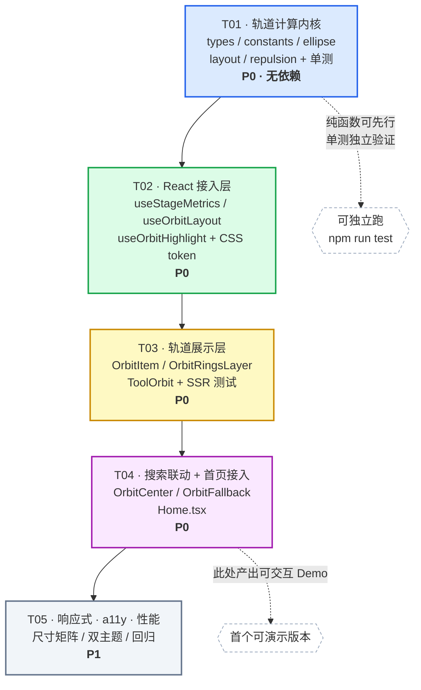

# 系统设计文档 —— 首页「工具环绕搜索框」同心圆环探索视图

- **项目**：普通日常工具箱（React18 + TS + Vite6 + Tailwind3 + Zustand，HashRouter，零后端 / 离线可用）
- **架构师**：高见远（Bob）
- **版本**：v1.0
- **状态**：设计稿（未写任何实现代码，未改动 `src/` 下任何文件）

---

## 0. 代码现状核实（已 Read 逐一确认）

| 项 | 核实结果 |
|---|---|
| 工具总数 | **66**（`grep category:` 统计：everyday 27 = life 23 + ai 3 + document 1；finance 6；health 7；image 15 = image 10 + magic 4 + pdf 1；fun 11 = fun 6 + magic 4 + media 1）✅ 与主理人给的数字一致 |
| 分类定义 | `src/tools/categories.ts`，5 类，含 `order`：everyday 1 / finance 2 / health 3 / image 4 / fun 5 |
| 首页 | `src/pages/Home.tsx`：sticky 品牌条(z-40) → `HomeHero` → sticky 分类条(z-30) → 已固定/收藏/最近/全部 `ToolGrid` → `DonateSection` → `OnboardingModal`(z-50) |
| 搜索 | `src/components/CommandSearch.tsx`（受控 `query`，内置下拉建议 / ↑↓ / Enter 跳转 / Esc；`forwardRef` 暴露 input，供 `Ctrl+K` 聚焦）。**搜索容器 `relative` 无 z-index**，下拉面板 `z-10`——这就是之前修过的层叠 bug，不得回退 |
| 匹配口径 | `matchPinyin(`${name} ${description} ${id}`, q)`，Home 与 CommandSearch 完全一致，**必须沿用** |
| 图标 | `ToolGrid.tsx` 导出 `iconMap` / `getToolIcon(name)`，可直接复用 |
| 分类配色 | `ToolGrid.tsx` 内部 `categoryColors`（未导出，需提升为共享常量） |
| 现有 z 轴 | 品牌条 40、分类条 30、CommandSearch 下拉 10、ToolPreviewCard 50、OnboardingModal 50、MobileNav 50、ShareButton 300/400 |
| 动效基建 | `src/index.css` 已有 `.shadow-glow`、`animate-fade-in`，且 **已全局处理 `prefers-reduced-motion`**（transition/animation 压到 0.01ms） |
| 主题色陷阱 | accent/card/bg 走 `rgb(var(--x-rgb) / <alpha-value>)`；**裸 `var(--accent)` 的透明度变体不会生成 CSS**（`border-accent/40` 无效） |
| 回归测试 | `src/components/__tests__/HomeHero.test.tsx` 用 `renderToStaticMarkup` **锁死**了首屏三句文案 + 常用工具 + 营销腔禁用词。它直接渲染 `HomeHero`，只要该组件文件保留就不会挂 |
| 现有依赖 | 无任何动画库（无 framer-motion / react-spring / gsap） |

---

# Part A：系统设计

## 1. 实现方案（Implementation Approach）

### 1.1 三个真正的技术难点

**难点一：66 个可读标签塞不进一个「同心圆」。**
一个轨道项要看清 2–8 个汉字，最小可用尺寸是「图标在上、标签两行 11px 在下」的 **76×62** 方块，沿弧长最小占位 `slot ≈ 90px`。66 项总共需要约 **5,940px 的环周长**。
如果用**正圆**，4 环等距（r = 300/396/492/588）总周长 ≈ 8,900px 够用，但**竖直方向要 2×588+62 = 1,238px**，远超任何笔记本视口的可用高度（约 700–780px）。中心搜索框会被顶到屏幕外，交互直接崩坏。

> **结论：必须用椭圆环（ellipse ring），而不是正圆环。**
> 视口是横向的（16:9 / 16:10），横向空间富余、纵向稀缺。令扁率 `k = ry/rx = 可用高/可用宽`（约 0.53），把环「压扁」贴合视口。
> 在 1440×760 的可用区里，4 环椭圆（rx = 313/428/543/658，ry = 166/227/288/349）总周长 ≈ 9,555px，**容量 104 项 ≫ 66**，纵向只占 760px，中心搜索框稳稳在正中。

椭圆带来一个副作用：**等角度步进在椭圆上不是等距的**（`ds/dθ = √(a²sin²θ + b²cos²θ)`，长轴两端最挤、短轴两端最疏）。
解法是 **等弧长参数化**：每环预先对 θ∈[0,2π) 采样 720 点建累积弧长表，第 i 项的目标弧长 `s_i = s_start + i·Δs`，二分反查得到 θ_i。720 点 × 4 环 = 2,880 次三角运算，一次性 <1ms，且随布局 memo 缓存。

**难点二：分类要「分层」，但 5 个分类的数量极不均衡（27/6/7/15/11）。**
若「一类一环」，27 项的 everyday 挤在最内环（周长最短）必然重叠；而 6 项的 finance 独占一整环则空得离谱，还白白多出两圈让 stage 变大。
解法是 **容量贪心装箱 + 分类段（segment）**：
- 环半径由**容器尺寸**决定（不是由分类决定），容量 `cap_j = floor(C(k)·rx_j / slot)` 自然算出；
- 按 `category.order` **顺序**把工具装进由内向外的环，一个分类可以**跨环**（仅当它足够大，`minSegment` 兜底防止出现「孤儿 1 项」），一个环也可以承载 **1–2 个分类**；
- 同一环上不同分类各占一段**连续角度扇区**，扇区之间留 `sectorGap = 6°` 的视觉缺口 + 一枚分类小标签。
这样既满足用户描述的「内圈日常、外圈图片/趣味」，又不会因为分类数量不均而爆炸。装箱结果在 1440×760 下典型为：
`ring0(cap 17) = everyday×17` → `ring1(cap 23) = everyday×10 + finance×6 + health×7` → `ring2(cap 29) = image×15 + fun×11` → `ring3` 未启用（容量足够时自动省掉）。

**难点三：66 个 DOM 节点同时动，不能掉帧。**
- 只改 `transform` 和 `opacity`——**绝对禁止**改 `left/top/width/height/margin`。基础坐标 `(bx, by)` 也走 `translate3d`，节点用 `left:50%; top:50%; margin:-h/2 0 0 -w/2` 定位到中心后全部靠 transform 摆放，布局树永不失效。
- 排斥计算是 **O(n × maxSources) = 66 × 8 = 528 次**距离运算，`useMemo` 只在 `highlightIds` 变化时跑，实测量级 <0.1ms，放主线程完全安全，**不需要 rAF 循环、不需要 Web Worker、不需要物理引擎**。
- `React.memo` + 稳定 `onActivate` 引用，保证只有 transform 真变了的节点才重渲染。
- `will-change: transform` **不常驻**（66 个常驻合成层会吃显存），只在 `searchQuery !== ''` 期间挂上，清空后移除。

### 1.2 动画方案选型：**纯 CSS transition，不引入任何新依赖**

| 方案 | 体积 | 结论 |
|---|---|---|
| **CSS `transition: transform, opacity` + inline transform** | **0 KB** | ✅ **采用** |
| framer-motion | ~40 KB gzip | ❌ 否决 |
| react-spring | ~20 KB gzip | ❌ 否决 |
| motion（mini 版） | ~5 KB gzip | ❌ 否决（仍无必要） |

理由：
1. 本项目硬约束是**零后端、离线可用、依赖精简**，首页为了一个位移效果加 40KB runtime 不划算。
2. 我们**不需要动画库最值钱的那几个能力**——没有 FLIP（元素永不改变文档流位置）、没有手势拖拽、没有编排时间线、没有 exit 动画（节点常驻）。
3. 需要的「弹性/呼吸感」用一条带轻微回弹的 cubic-bezier 就能拿到：
   `cubic-bezier(0.34, 1.24, 0.44, 1)` —— 比常见的 `(0.34,1.56,0.64,1)` 收敛，66 个元素同时回弹时不会显得躁。
4. `prefers-reduced-motion` 已被 `src/index.css` 全局兜住，用 CSS 方案可以免费继承；用 JS 动画库反而要额外处理。

**唯一需要小心的点**：CSS keyframe 动画（如 idle 呼吸浮动）会**覆盖** inline 的 `transform`。
解法是 **两层 DOM**：
```
<div class="orbit-item" style="transform: translate3d(bx+dx, by+dy, 0) scale(s)">   ← 定位 + 排斥（inline，JS 驱动）
  <div class="orbit-item__float">                                                   ← idle 浮动（CSS keyframe，独立 transform）
    <button class="orbit-chip">图标 + 标签</button>                                  ← 高亮态（class 驱动的发光/描边）
  </div>
</div>
```
两层各自拥有独立的 transform 上下文，互不打架。

### 1.3 架构模式

**纯函数内核 + 薄 Hook 适配 + 无状态展示组件**（近似 MVVM 的 M / VM / V 三分）：

```
M  src/lib/orbit/*        纯 TS，零 React、零 DOM，可 100% 单测
VM src/hooks/useOrbit*    ResizeObserver + useMemo，把内核结果适配成 React 状态
V  src/components/orbit/* 只读 props，只吐 JSX + inline transform
```
好处：布局算法和排斥算法可以在 `vitest`（当前 `environment: 'node'`）里直接跑数值断言，不需要 jsdom，也不依赖渲染。

---

## 2. 文件列表（File List）

### 2.1 新建

| 相对路径 | 类型 | 职责 |
|---|---|---|
| `src/lib/orbit/types.ts` | 纯 TS | 全部接口定义（OrbitConfig / OrbitRing / OrbitSegment / OrbitNode / OrbitLayout / OrbitTransform / RepulsionConfig） |
| `src/lib/orbit/orbitConstants.ts` | 纯 TS | 断点表、各断点布局配置、排斥参数、动画时长/缓动、z 轴常量、分类配色、分类圈层顺序、功能开关 |
| `src/lib/orbit/ellipse.ts` | 纯 TS | 椭圆几何：周长系数 `C(k)`、Ramanujan 周长、等弧长采样表、`thetaAtArcLength`、`pointAt` |
| `src/lib/orbit/layout.ts` | 纯 TS | 布局内核：`resolveConfig` / `planRings` / `planBands` / `placeNodes` / `computeOrbitLayout` |
| `src/lib/orbit/repulsion.ts` | 纯 TS | 排斥内核：`falloffValue` / `computeRepulsion` |
| `src/lib/orbit/__tests__/layout.test.ts` | 测试 | 66 项全部落位、无重叠、不越界、分类连续、跨断点稳定 |
| `src/lib/orbit/__tests__/repulsion.test.ts` | 测试 | 方向正确（径向朝外）、衰减单调、幅值钳制、空高亮集恒等、匹配项零位移 |
| `src/hooks/useStageMetrics.ts` | Hook | ResizeObserver 量化尺寸（40px 桶）+ 断点判定 + `prefers-reduced-motion` 探测 |
| `src/hooks/useOrbitLayout.ts` | Hook | `useMemo` 包装 `computeOrbitLayout` |
| `src/hooks/useOrbitHighlight.ts` | Hook | `matchPinyin` 过滤 → `highlightIds` → `computeRepulsion` → `transforms` |
| `src/components/orbit/ToolOrbit.tsx` | 组件 | 舞台容器：测量、组装三个 Hook、渲染引导环 / 中心 / 66 个项 |
| `src/components/orbit/OrbitItem.tsx` | 组件 | 单个轨道项（`React.memo`），三层 DOM，consume `OrbitTransform` |
| `src/components/orbit/OrbitRingsLayer.tsx` | 组件 | 装饰性椭圆引导线 + 每段分类小标签（`pointer-events:none`） |
| `src/components/orbit/OrbitCenter.tsx` | 组件 | 中心插槽：标题一行 + 复用 `CommandSearch` + 「找到 N 个工具」计数 |
| `src/components/orbit/OrbitFallback.tsx` | 组件 | 小屏降级视图（默认复用 `HomeHero` + 分类 `ToolGrid`） |
| `src/components/orbit/__tests__/ToolOrbit.test.tsx` | 测试 | SSR 快照：66 个工具名全部出现、无营销腔词、z 轴不超过 20 |

### 2.2 修改

| 相对路径 | 改动 |
|---|---|
| `src/pages/Home.tsx` | 用 `<ToolOrbit>` / `<OrbitFallback>` 替换 `<HomeHero>`；`Ctrl+K` 的 `searchRef` 透传到 ToolOrbit；**保留** URL `?q=` / `?category=` 同步、Onboarding、已固定/收藏/最近/全部网格与赞赏区（下移到圆环下方） |
| `src/components/ToolGrid.tsx` | 仅一处：把内部 `categoryColors` 提升为 `export const`（或迁至 `orbitConstants.ts` 后从这里 re-export），**其余逻辑一律不动** |
| `src/index.css` | 新增 `@layer utilities` 段：`.orbit-item` / `.orbit-item__float` / `.orbit-chip` 的动效 token（CSS 变量形式），以及 `@keyframes orbit-float`；在既有 `prefers-reduced-motion` 块中追加禁用 `orbit-float` |
| `src/components/HomeHero.tsx` | **不改**（保留原样，被 `OrbitFallback` 复用，`HomeHero.test.tsx` 因此零风险） |

> **明确不动**：`CommandSearch.tsx`（含那处已修复的层叠结构）、`OnboardingModal.tsx`、`Layout.tsx`、`App.tsx`、`store/index.ts`、`lib/pinyinSearch.ts`、所有工具实现。

---

## 3. 数据结构与接口（Data Structures and Interfaces）

### 3.1 TypeScript 接口定义（`src/lib/orbit/types.ts`）

```ts
/** 断点：sm = <640 降级；md = 640~1023；lg = >=1024 */
export type OrbitBreakpoint = 'sm' | 'md' | 'lg';

/** 轨道项的视觉状态，驱动 class 而非 style */
export type OrbitItemState = 'idle' | 'matched' | 'pushed' | 'dimmed';

export type FalloffKind = 'quadratic' | 'linear';

export interface Point { x: number; y: number }

export interface StageBox {
  /** 舞台可用宽（px，已量化到 40px 桶） */
  width: number;
  /** 舞台可用高（px，已量化到 40px 桶） */
  height: number;
}

/** 单个断点下的布局配置，全部单位 px（除 sectorGapRad 为弧度） */
export interface OrbitConfig {
  breakpoint: OrbitBreakpoint;
  /** 轨道项外框尺寸 */
  itemW: number;
  itemH: number;
  /** 沿弧长的理想占位（itemW + 呼吸间隙） */
  slotIdeal: number;
  /** 装不下时允许压缩到的下限 */
  slotMin: number;
  /** 中心搜索框的安全椭圆半轴，ring0 不得侵入 */
  centerSafeRx: number;
  centerSafeRy: number;
  /** ring0 半长轴相对 rxMax 的比例（在 centerSafe 之上取大者） */
  innerRatio: number;
  /** 环数上限 */
  maxRings: number;
  /** 一个分类被允许拆分到相邻环时，每段的最小项数（防孤儿） */
  minSegment: number;
  /** 同环相邻两个分类段之间的角度缺口（弧度） */
  sectorGapRad: number;
  /** 椭圆扁率下限/上限，k = ry/rx */
  kMin: number;
  kMax: number;
}

/** 一个环上属于同一分类的连续角度扇区 */
export interface OrbitSegment {
  categoryId: string;
  /** 该段在本环上的项数 */
  count: number;
  /** 段起止角（弧度，0 = 3 点钟方向，顺时针为正，因 CSS y 轴向下） */
  startTheta: number;
  endTheta: number;
  /** 分类标签的锚点（段中点在椭圆上的坐标，相对舞台中心） */
  labelAnchor: Point;
}

export interface OrbitRing {
  index: number;            // 由内向外，从 0 开始
  rx: number;               // 半长轴（水平）
  ry: number;               // 半短轴（垂直）
  perimeter: number;        // Ramanujan 近似周长
  capacity: number;         // floor(perimeter / slot)
  segments: OrbitSegment[]; // 按角度顺序
}

/** 单个工具在轨道上的静态落位（与搜索无关，只随尺寸变化） */
export interface OrbitNode {
  toolId: string;
  categoryId: string;
  ringIndex: number;
  indexInRing: number;
  /** 弧度 */
  theta: number;
  /** 基础坐标：相对舞台中心，px，右为 +x、下为 +y */
  bx: number;
  by: number;
}

export interface OrbitLayout {
  config: OrbitConfig;
  stage: StageBox;
  /** 实际采用的扁率 ry/rx */
  k: number;
  /** 实际采用的弧长占位 */
  slot: number;
  rings: OrbitRing[];
  nodes: OrbitNode[];
  nodeById: Record<string, OrbitNode>;
  /** 极端窄屏下容量仍不足时被挤出的工具 id（正常应为空数组，非空需上报） */
  overflowIds: string[];
  /** 舞台实际需要的内容盒（用于外层容器 min-height） */
  contentW: number;
  contentH: number;
}

/** 每帧要写到 DOM 上的视觉量，全部只影响合成层 */
export interface OrbitTransform {
  dx: number;      // 排斥位移 x（px）
  dy: number;      // 排斥位移 y（px）
  scale: number;   // 缩放
  opacity: number; // 透明度
  z: number;       // z-index（恒 <= 20）
  state: OrbitItemState;
}

export interface RepulsionConfig {
  enabled: boolean;
  /** 影响半径：超出则完全不受该高亮源影响（px） */
  radius: number;
  /** 距离为 0 时的峰值位移（px） */
  strength: number;
  /** 单个节点的位移幅值上限（px） */
  maxOffset: number;
  /** 参与叠加的高亮源数量上限（取最近的 N 个） */
  maxSources: number;
  falloff: FalloffKind;
  /** 匹配项的放大倍数 */
  matchedScale: number;
  /** 未匹配项的缩小倍数 */
  dimmedScale: number;
  /** 未匹配项的透明度 */
  dimmedOpacity: number;
}

export interface OrbitHighlightResult {
  highlightIds: Set<string>;
  transforms: Record<string, OrbitTransform>;
  matchCount: number;
  isSearching: boolean;
}
```

### 3.2 内核函数签名

```ts
// ── src/lib/orbit/ellipse.ts ───────────────────────────────────────────────
/** Ramanujan 周长的线性因子：perimeter = C(k) * rx，k = ry/rx。k=0.53 → ≈4.92 */
export function perimeterFactor(k: number): number;
export function ellipsePerimeter(rx: number, ry: number): number;

export interface ArcTable { rx: number; ry: number; total: number; cum: Float64Array }
/** samples 默认 720 */
export function buildArcTable(rx: number, ry: number, samples?: number): ArcTable;
/** 二分 + 线性插值，返回 [0, 2π) 内的 θ */
export function thetaAtArcLength(table: ArcTable, s: number): number;
export function pointAt(rx: number, ry: number, theta: number): Point;

// ── src/lib/orbit/layout.ts ────────────────────────────────────────────────
export function resolveConfig(stage: StageBox): OrbitConfig;

export interface CategoryGroup { categoryId: string; toolIds: string[] }
/** 按 categories.order 分组并保持组内原始顺序 */
export function groupByCategory(tools: ToolRecord[]): CategoryGroup[];

/** 只算半径与容量，不装箱 */
export function planRings(
  stage: StageBox, cfg: OrbitConfig, slot: number, ringCount: number
): Omit<OrbitRing, 'segments'>[];

/** 容量贪心装箱：决定每环放哪些分类、各放几项 */
export function planBands(
  rings: Omit<OrbitRing, 'segments'>[], groups: CategoryGroup[], cfg: OrbitConfig
): { rings: OrbitRing[]; ringToolIds: string[][]; overflowIds: string[] };

/** 段内等弧长求角 → 落位 */
export function placeNodes(
  rings: OrbitRing[], ringToolIds: string[][], groups: CategoryGroup[]
): OrbitNode[];

/** 唯一对外入口，内部含 slot 递减的 fit-loop */
export function computeOrbitLayout(tools: ToolRecord[], stage: StageBox): OrbitLayout;

// ── src/lib/orbit/repulsion.ts ─────────────────────────────────────────────
export function falloffValue(dist: number, radius: number, kind: FalloffKind): number;
export function computeRepulsion(
  nodes: OrbitNode[], highlightIds: Set<string>, cfg: RepulsionConfig
): Record<string, OrbitTransform>;
```

### 3.3 组件 Props

```ts
// src/components/orbit/ToolOrbit.tsx
export interface ToolOrbitProps {
  tools: ToolRecord[];
  searchQuery: string;
  onSearchChange: (v: string) => void;
  onSearchFocus?: () => void;                 // Home 用它关闭 Onboarding
  searchInputRef: RefObject<HTMLInputElement>; // Ctrl+K 聚焦
  /** 分类条选中态：该分类整段高亮，仅影响引导线与标签，不参与排斥 */
  activeCategoryId?: string | null;
  className?: string;
}

// src/components/orbit/OrbitItem.tsx
export interface OrbitItemProps {
  node: OrbitNode;
  tool: ToolRecord;
  transform: OrbitTransform;
  itemW: number;
  itemH: number;
  /** 入场 stagger 序号 */
  enterIndex: number;
  onActivate: (toolId: string) => void;   // 必须 useCallback 稳定
}

// src/components/orbit/OrbitRingsLayer.tsx
export interface OrbitRingsLayerProps {
  rings: OrbitRing[];
  activeCategoryId?: string | null;
  showLabels: boolean;      // sm/md 下关闭
}

// src/components/orbit/OrbitCenter.tsx
export interface OrbitCenterProps {
  tools: ToolRecord[];
  query: string;
  matchCount: number;
  onQueryChange: (v: string) => void;
  onFocus?: () => void;
  inputRef: RefObject<HTMLInputElement>;
  maxWidth: number;         // = centerSafeRx * 2 - 40
}

// src/components/orbit/OrbitFallback.tsx
export interface OrbitFallbackProps {
  tools: ToolRecord[];
  searchQuery: string;
  onSearchChange: (v: string) => void;
  onSearchFocus?: () => void;
  searchInputRef: RefObject<HTMLInputElement>;
}

// src/hooks/useStageMetrics.ts
export interface StageMetrics {
  stage: StageBox;                 // 已量化
  breakpoint: OrbitBreakpoint;
  reducedMotion: boolean;
  ready: boolean;                  // 首次测量完成前为 false（避免 0×0 布局闪烁）
}
export function useStageMetrics(ref: RefObject<HTMLElement>): StageMetrics;
```

### 3.4 布局算法伪代码（Engineer 直接照抄的规格）

```
computeOrbitLayout(tools, stage):
  cfg   = resolveConfig(stage)
  total = tools.length                                  # 66
  groups = groupByCategory(tools)                       # 按 category.order

  # 椭圆扁率跟随容器纵横比，钳制在 [kMin, kMax]
  k = clamp(stage.height / stage.width, cfg.kMin, cfg.kMax)
  C = perimeterFactor(k)

  # 外圈上限：横向、纵向都不能溢出
  rxMax = min((stage.width  - cfg.itemW) / 2,
              (stage.height - cfg.itemH) / (2 * k))
  rx0   = max(cfg.centerSafeRx, rxMax * cfg.innerRatio)

  # fit-loop：先加环，再压 slot
  for slot in [cfg.slotIdeal, cfg.slotIdeal-4, ..., cfg.slotMin]:
      for n in [3 .. cfg.maxRings]:
          rings = planRings(stage, cfg, slot, n)        # rx_j 等差，ry_j = rx_j * k
          if sum(rings.capacity) >= total * 1.05:       # 留 5% 装箱余量
              plan = planBands(rings, groups, cfg)
              if plan.overflowIds is empty: goto DONE
  # 兜底（极端窄屏）：用 maxRings + slotMin，把溢出项记入 overflowIds 上报
DONE:
  nodes = placeNodes(plan.rings, plan.ringToolIds, groups)
  return { ..., k, slot, rings, nodes, nodeById, overflowIds, contentW, contentH }


planRings(stage, cfg, slot, n):
  step = n > 1 ? (rxMax - rx0) / (n - 1) : 0
  for j in 0..n-1:
      rx = rx0 + j * step
      ry = rx * k
      perimeter = C * rx                                # 线性，无需数值积分
      capacity  = floor(perimeter / slot)


planBands(rings, groups, cfg):
  # 贪心：按 order 顺序把分类装进由内向外的环
  j = 0; remaining = rings[0].capacity
  for g in groups:
      left = g.toolIds.length
      while left > 0:
          if remaining >= left:                          # 整类塞得下
              put(j, g, left); remaining -= left; left = 0
          else if remaining >= cfg.minSegment and (left - remaining) >= cfg.minSegment:
              put(j, g, remaining); left -= remaining    # 允许跨环拆，两段都不小于 minSegment
              j++; remaining = rings[j].capacity
          else:                                          # 拆了会产生孤儿 → 整类顺延
              j++; remaining = rings[j].capacity
  # 角度分配：本环 m 个段，总可用角 = 2π - m * sectorGapRad
  for each ring:
      usable = 2π - segments.length * cfg.sectorGapRad
      theta  = ringStartOffset(ring.index)               # 见「共享知识」错位规则
      for seg in segments:
          span = usable * seg.count / ring.itemCount
          seg.startTheta = theta
          seg.endTheta   = theta + span
          theta = seg.endTheta + cfg.sectorGapRad


placeNodes(rings, ringToolIds, groups):
  for ring in rings:
      table = buildArcTable(ring.rx, ring.ry, 720)
      for seg in ring.segments:
          sStart = arcLengthAt(table, seg.startTheta)
          sEnd   = arcLengthAt(table, seg.endTheta)
          # 段内首尾各留半个步长，避免紧贴扇区缺口
          step   = (sEnd - sStart) / seg.count
          for i in 0..seg.count-1:
              theta   = thetaAtArcLength(table, sStart + step * (i + 0.5))
              (bx,by) = pointAt(ring.rx, ring.ry, theta)
```

### 3.5 排斥算法伪代码

```
computeRepulsion(nodes, H, cfg):
  out = {}
  if H is empty or not cfg.enabled:
      for n in nodes: out[n.toolId] = {dx:0, dy:0, scale:1, opacity:1, z:Z.item, state:'idle'}
      return out

  for n in nodes:
      if H.has(n.toolId):
          # 匹配项：不位移，只放大 + 提层 + 发光（发光由 class 做）
          out[n.toolId] = {dx:0, dy:0, scale:cfg.matchedScale, opacity:1,
                           z:Z.matched, state:'matched'}
          continue

      # 取最近的 maxSources 个高亮源（先按距离排序再截断，避免大匹配集下方向抵消成噪声）
      srcs = nearest(H, n, cfg.maxSources)
      ax = 0; ay = 0; hit = 0
      for h in srcs:
          vx = n.bx - h.bx; vy = n.by - h.by
          d  = hypot(vx, vy)
          if d >= cfg.radius: continue
          if d < 1e-3: continue                       # 同点保护
          w  = cfg.strength * falloffValue(d, cfg.radius, cfg.falloff)
          ax += w * vx / d; ay += w * vy / d          # 单位向量 × 权重，方向 = 背离高亮项
          hit++

      if hit > 1:                                     # 多源叠加做能量归一，防止爆量
          ax /= sqrt(hit); ay /= sqrt(hit)

      mag = hypot(ax, ay)
      if mag > cfg.maxOffset:                         # 幅值钳制
          ax *= cfg.maxOffset / mag; ay *= cfg.maxOffset / mag

      out[n.toolId] = {
        dx: ax, dy: ay,
        scale: cfg.dimmedScale,
        opacity: cfg.dimmedOpacity,
        z: hit > 0 ? Z.pushed : Z.item,
        state: hit > 0 ? 'pushed' : 'dimmed'
      }
  return out

falloffValue(d, R, kind):
  t = 1 - d / R                    # t ∈ (0, 1]
  return kind == 'quadratic' ? t*t : t
```

> **关键语义**：位移方向 = `高亮项 → 邻居` 的单位向量，即**背离高亮项**径向推开，与需求「往远离高亮工具的方向位移」完全一致。
> **匹配项之间互不排斥**（H 内元素位移恒为 0），否则多匹配时整个环会集体炸开，观感失控。

---

## 4. 程序调用流程（Program Call Flow）

完整时序图见 [`docs/sequence-diagram.mermaid`](./sequence-diagram.mermaid)，包含 5 段：
- **A 初始化与布局构建** —— 挂载 → ResizeObserver → `computeOrbitLayout`（fit-loop → 等弧长落位）→ 首帧 stagger 入场
- **B 搜索输入 → 高亮 + 排斥**（核心链路）—— `CommandSearch.onQueryChange` → `store.setSearchQuery` → `useOrbitHighlight` → `matchPinyin` ×66 → `highlightIds` → `computeRepulsion` → `transforms` → `OrbitItem` inline transform → CSS transition → 合成层
- **C 清空复位** —— 同一条 transition 反向播放，弹性归位
- **D 打开工具** —— `onActivate` → `updateRecentUse` → `navigate('/tool/:id')`（既有能力保持不变）
- **E 视口变化** —— 40px 桶去抖 → 重算布局 → 仍走 transform 平滑迁移；跨 640px 时由 Home 切换 Orbit / Fallback

类图见 [`docs/class-diagram.mermaid`](./class-diagram.mermaid)。

**关键调用顺序（浓缩）**：

```
输入 "压缩"
  → CommandSearch.handleChange
  → onQueryChange → OrbitCenter → ToolOrbit → Home.onSearchChange
  → useStore.setSearchQuery("压缩")            [唯一状态源，与现有网格过滤共用]
  → Home 重渲染 → ToolOrbit 收到新 searchQuery
  → useOrbitHighlight(tools, layout, "压缩")
      ├─ trimmed = "压缩"；空则短路
      ├─ tools.filter(t => matchPinyin(`${t.name} ${t.description} ${t.id}`, q))  → highlightIds
      └─ computeRepulsion(layout.nodes, highlightIds, repCfg)                     → transforms
  → ToolOrbit 把 transforms[toolId] 传给对应 OrbitItem（React.memo 逐项比对）
  → OrbitItem: style.transform = `translate3d(${bx+dx}px, ${by+dy}px, 0) scale(${scale})`
               style.opacity   = opacity
               className      += state 对应的高亮/暗淡 class
  → 浏览器按 `transition: transform 340ms var(--orbit-ease-move), opacity 200ms ease-out`
    在合成层插值，全程 0 次 layout、0 次 paint
```

---

## 5. 待明确事项（Anything UNCLEAR）

> 以下 9 项**需要主理人/用户拍板**。每项我都给了「建议默认值」，Engineer 可以按建议先跑通，回头再按最终决策改常量——所有决策点都被收敛到 `orbitConstants.ts` 一个文件里，改动成本极低。

| # | 问题 | 我的建议默认 |
|---|---|---|
| **Q1** | **小屏 (<640px) 到底怎么办？** 我算过了：390px 宽的视口，半长轴上限只有 165px，即使把项压到 52×48（标签 9px，已经不可读），3 环最多容纳约 58 项，**装不下 66 项**。「同心圆环 + 可读标签」在竖屏手机上**数学上不成立**，必须降级。<br>**A**（省）复用现有 `HomeHero` + 分类网格；**B**（概念统一）中心搜索框 + **仅 5 个分类节点**环绕成一圈，点分类在下方展开紧凑网格，搜索时网格项高亮 + 邻居微位移 | **A**（T04 基线，零回归风险）；若要 B，作为 T05 增强单独排期 |
| **Q2** | 未匹配的工具是**变暗**还是**保持原样**？ | 变暗但不灰度：`opacity 0.32` + `scale 0.94`。**不要用 `filter: grayscale()`**，66 个节点上的 filter 会显著加重合成开销 |
| **Q3** | 多匹配时排斥如何叠加？ | 向量求和 → 除以 `√(生效源数)` 归一 → 钳幅 28px；只取最近 8 个高亮源；**匹配项之间互不排斥** |
| **Q4** | 圆环下方是否**保留**现有的「已固定 / 收藏 / 最近 / 全部工具网格 / 赞赏区」？ | **保留**，放在圆环 section 下方，滚动可达。直接删掉会丢功能（固定/收藏/最近使用是既有能力） |
| **Q5** | 现有首屏三句文案（「一个网页，解决你的日常小问题」/「无需安装…」/ 搜索 placeholder）在环形版**是否保留**？注意 `HomeHero.test.tsx` 锁死了这些字符串 | 主标题放在中心搜索框**正上方一行**（环内），副标题省略（环内空间宝贵），placeholder 原样保留。`HomeHero.tsx` 文件保留 → 老测试不受影响 |
| **Q6** | 分类的**由内向外顺序**是否就用 `categories.order`（everyday→finance→health→image→fun）？ | 是。与用户举例的「内圈日常、外圈图片/趣味」一致 |
| **Q7** | 现有 sticky 分类横向滚动条（z-30）在环形首页**是否保留**？点分类是「过滤」还是「高亮该圈层」？ | 保留控件；语义改为**高亮该分类的圈层段**（引导线加亮 + 该段项微微外扩），**不过滤**——过滤会让环出现大片空缺，很难看 |
| **Q8** | idle「呼吸浮动」动画默认**开还是关**？66 个无限 CSS 动画会持续占用合成器（笔记本耗电、低端机掉帧） | **默认关**（`ENABLE_IDLE_FLOAT = false`）。代码通路完整保留，一个常量即可开启；开启时 duration 6–9s、幅度 ±3px、按 index 错开 delay |
| **Q9** | 键盘可达性：66 个环上按钮的 Tab 顺序如何定？是否需要方向键在环上导航？ | DOM 顺序 = 分类顺序 = 视觉顺序，自然 Tab 即可；**不做**方向键环形导航（成本高、收益低）。给 stage 加 `role="list"`、每项 `role="listitem"`，并提供一个视觉隐藏的「跳过工具环」锚点 |

**其他已做的假设（如与预期不符请纠正）**：
- 舞台高度取 `min(视口高 - 顶部品牌条 56px - 上下留白, 780px)`，不占满整屏，保证下方内容有「还有东西」的暗示。
- `overflowIds` 非空时（理论上只会出现在极端窄视口）在环下方追加一行「其余 N 个工具」的紧凑胶囊列表兜底，绝不静默丢工具。
- 轨道项的可点击热区 ≥ 44×44（移动端 a11y 下限）。

---

# Part B：任务拆解

## 6. 依赖包（Required Packages）

### 需要新增的 npm 包

**无。一个都不加。**

理由已在 §1.2 展开：动画走纯 CSS transition + inline transform；椭圆几何是 30 行数学；排斥是 528 次浮点运算。引入 framer-motion（~40KB gzip）与本项目「零后端、离线可用、依赖精简」的定位冲突，且它最值钱的 FLIP / 手势 / 编排能力这里一个都用不上。

### 复用的既有依赖

```
react@^18.3.1              视图层
react-dom@^18.3.1
react-router-dom@^7.3.0    useNavigate 跳转 /tool/:id（HashRouter，不变）
zustand@^5.0.3             searchQuery / selectedCategory 单一状态源
lucide-react@^0.511.0      工具图标（经 ToolGrid.getToolIcon 复用同一套 iconMap）
clsx@^2.1.1                轨道项状态 class 组合
tailwind-merge@^3.0.2      class 去冲突
tailwindcss@^3.4.17        样式
vitest@^4.1.10             内核单测（environment: 'node'，纯函数直接跑，无需 jsdom）
```

### 浏览器 API 依赖（均无需 polyfill，目标浏览器全支持）

```
ResizeObserver             舞台尺寸测量
matchMedia                 prefers-reduced-motion 探测
Float64Array               等弧长累积表
```

---

## 7. 任务列表（按依赖顺序）

### T01 · 轨道计算内核（类型 / 常量 / 几何 / 布局 / 排斥 + 单测）

- **Priority**: P0
- **Dependencies**: 无
- **Source Files**:
  - `src/lib/orbit/types.ts`（新建）
  - `src/lib/orbit/orbitConstants.ts`（新建）
  - `src/lib/orbit/ellipse.ts`（新建）
  - `src/lib/orbit/layout.ts`（新建）
  - `src/lib/orbit/repulsion.ts`（新建）
  - `src/lib/orbit/__tests__/layout.test.ts`（新建）
  - `src/lib/orbit/__tests__/repulsion.test.ts`（新建）
- **要点**：
  - 严格按 §3.1 接口、§3.4 / §3.5 伪代码实现，**零 React、零 DOM 引用**（除了从 `@/types` 引 `ToolRecord`、从 `@/tools/categories` 引 `categories`）。
  - `orbitConstants.ts` 必须承载全部可调参数（三个断点的 `OrbitConfig`、`RepulsionConfig`、动画时长/缓动、`ORBIT_Z`、`ENABLE_IDLE_FLOAT`、分类配色），§5 的所有决策点都要能在这一个文件里改。
  - 单测断言（必须全绿）：
    1. `computeOrbitLayout(builtInTools, {1440,760})` → `nodes.length === 66`、`overflowIds` 为空；
    2. 任意两节点的**中心距 ≥ min(itemW, itemH) × 0.9**（无重叠）；
    3. 所有 `|bx| + itemW/2 <= stage.width/2` 且 `|by| + itemH/2 <= stage.height/2`（不越界）；
    4. 每个分类的节点在「环序 + 环内角序」上**连续**（不出现 A-B-A 交错）；
    5. 环序满足 `categories.order`（everyday 的最小 ringIndex ≤ fun 的最小 ringIndex）；
    6. 在 `{1024,640} / {1280,700} / {1440,760} / {1920,900}` 四种尺寸下均无 overflow；
    7. `computeRepulsion(nodes, new Set(), cfg)` → 全部 `{dx:0,dy:0,scale:1,opacity:1}`；
    8. 单高亮源时，邻居位移向量与 `(邻居 - 高亮)` 的**夹角 < 1e-6**（方向正确）；
    9. 位移幅值随距离**单调不增**，且恒 `<= maxOffset`；
    10. 高亮项自身位移恒为 0。
- **验收**：`npm run test` 全绿，`npm run check` 无 TS 报错。

---

### T02 · React 接入层 Hooks + 动效样式 token

- **Priority**: P0
- **Dependencies**: T01
- **Source Files**:
  - `src/hooks/useStageMetrics.ts`（新建）
  - `src/hooks/useOrbitLayout.ts`（新建）
  - `src/hooks/useOrbitHighlight.ts`（新建）
  - `src/index.css`（修改：新增 orbit 动效 token 与 keyframes，并在既有 `prefers-reduced-motion` 块中追加 `orbit-float` 禁用）
  - `src/components/ToolGrid.tsx`（修改：仅把 `categoryColors` 提升为 `export const`，其余不动）
- **要点**：
  - `useStageMetrics`：`ResizeObserver` 观测容器；宽高**量化到 40px 桶**（`Math.round(v/40)*40`）后才 `setState`，避免拖拽窗口时每像素重算；同时输出 `breakpoint` 与 `matchMedia('(prefers-reduced-motion: reduce)')` 结果；首次测量完成前 `ready=false`（外层渲染骨架，避免 0×0 布局闪一下）；卸载时 `disconnect()`。
  - `useOrbitLayout`：`useMemo(() => computeOrbitLayout(tools, stage), [tools, stage.width, stage.height])`，**依赖数组只放基本类型**。
  - `useOrbitHighlight`：`highlightIds` 与 `transforms` 分成两个 `useMemo`；`reducedMotion` 为真时把 `RepulsionConfig.enabled` 置 false（**只保留高亮，不做位移**）；匹配口径必须与 `Home.tsx` / `CommandSearch.tsx` 逐字一致：`matchPinyin(\`${t.name} ${t.description} ${t.id}\`, q)`。
  - `src/index.css` 新增（`@layer utilities` 内）：
    ```
    :root { --orbit-dur-move: 340ms; --orbit-dur-fade: 200ms;
            --orbit-ease-move: cubic-bezier(0.34, 1.24, 0.44, 1); }
    .orbit-item  { position:absolute; left:50%; top:50%;
                   transition: transform var(--orbit-dur-move) var(--orbit-ease-move),
                               opacity   var(--orbit-dur-fade)  ease-out; }
    .orbit-item--interacting { will-change: transform; }
    .orbit-item__float { /* 独立 transform 层，承载 orbit-float keyframe */ }
    @keyframes orbit-float { 0%,100%{transform:translateY(0)} 50%{transform:translateY(-3px)} }
    ```
    发光一律复用既有 `.shadow-glow`；**颜色禁止写 `border-accent/40` 这类带透明度的变体**（accent 是 CSS 变量色，Tailwind 不会生成规则）——要透明度就用 `rgb(var(--accent-rgb) / .4)`。
- **验收**：`npm run check` 通过；Hook 层可在 Node 环境下被间接单测（内核已覆盖，这里不强求 jsdom 测试）。

---

### T03 · 轨道展示层组件（引导环 / 单项 / 舞台容器）

- **Priority**: P0
- **Dependencies**: T01, T02
- **Source Files**:
  - `src/components/orbit/OrbitItem.tsx`（新建）
  - `src/components/orbit/OrbitRingsLayer.tsx`（新建）
  - `src/components/orbit/ToolOrbit.tsx`（新建）
  - `src/components/orbit/__tests__/ToolOrbit.test.tsx`（新建）
- **要点**：
  - `OrbitItem` 用 §1.2 的**三层 DOM**（定位层 / 浮动层 / chip 层），`React.memo` 包裹，比较函数只看 `transform` 四个数值 + `state`。
  - chip 内容：图标（`getToolIcon`，20–24px）在上，工具名在下（`text-[11px] leading-[1.15]`，最多两行 `line-clamp-2`，`text-balance`）。热区 ≥ 44×44。
  - 定位方式**只能**是 `left:50%; top:50%; margin:-h/2 0 0 -w/2` + `translate3d(bx+dx, by+dy, 0) scale(s)`。**禁止**写 `left:${x}px`。
  - z 轴：引导线 `z-0`、普通项 `z-[1]`、被推开项 `z-[2]`、匹配项 `z-[6]`、中心 `z-[10]`。**上限 20，绝不触碰 30/40/50**（否则会压过 sticky 分类条 / 品牌条 / OnboardingModal）。
  - `OrbitRingsLayer`：绝对定位的 `<div>` + `border-radius:50%` + `1px dashed rgb(var(--accent-rgb)/.10)`，`pointer-events:none`；分类小标签锚在段中点（`showLabels` 为 false 时不渲染）。
  - `ToolOrbit`：组装 `useStageMetrics` / `useOrbitLayout` / `useOrbitHighlight`；`onActivate` 用 `useCallback` 稳定引用；`searchQuery !== ''` 时给所有项挂 `orbit-item--interacting`（`will-change`），清空后移除；`overflowIds` 非空时在环下方渲染兜底胶囊行。
  - 入场：`enterIndex` → `transition-delay: min(index*8, 320)ms` 的 opacity+scale 淡入，只跑一次。
  - 测试（SSR，`renderToStaticMarkup` + `MemoryRouter`，沿用 HomeHero.test 的写法）：66 个工具名全部出现在 HTML 里；输出中不含 `z-30`/`z-40`/`z-50`；不含营销腔禁用词。
- **验收**：`npm run test` 全绿；本地 `npm run dev` 目视：66 项均匀分布、无重叠、标签可读。

---

### T04 · 中心搜索联动 + 小屏降级 + 首页接入

- **Priority**: P0
- **Dependencies**: T03
- **Source Files**:
  - `src/components/orbit/OrbitCenter.tsx`（新建）
  - `src/components/orbit/OrbitFallback.tsx`（新建）
  - `src/pages/Home.tsx`（修改）
- **要点**：
  - `OrbitCenter` **必须包裹复用** `CommandSearch`，不得复制其逻辑——它承载着「下拉建议 / ↑↓ / Enter 跳转 / Esc / 点击外部关闭」和**那处已修复的层叠结构**（容器 `relative` 无 z-index、下拉面板 `z-10`）。外层只加宽度约束与 `z-[10]` 定位，**不得给 CommandSearch 内部容器加 z-index**。
  - 中心区自上而下：主标题一行（见 Q5）→ `CommandSearch` → 「找到 N 个工具」计数（`aria-live="polite"`，无输入时不渲染）。
  - `OrbitFallback`（Q1 方案 A）：直接组合既有 `HomeHero` + 分类 `ToolGrid`，**零新逻辑**。
  - `Home.tsx` 改动清单（逐条核对，防回归）：
    1. `<HomeHero>` → `bp === 'sm' ? <OrbitFallback/> : <ToolOrbit/>`（断点由 `useStageMetrics` 或一个轻量 `matchMedia` 给出）；
    2. `searchRef` 继续透传（`Ctrl+K` 聚焦不能坏）；
    3. `?q=` / `?category=` 的 URL 同步 `useEffect` **原样保留**；
    4. 首次进入清空 `selectedCategory/searchQuery` 的 `useEffect` **原样保留**；
    5. `dismissOnboarding` 继续挂在搜索框 `onFocus` 上；
    6. sticky 品牌条（z-40）、sticky 分类条（z-30）、`OnboardingModal`（z-50）**位置与 z 值一律不动**；
    7. 「已固定 / 收藏 / 最近 / 全部工具 / 赞赏」整块下移到圆环 section 之后（Q4）。
- **验收**：`npm run test && npm run check && npm run build` 全绿；手测清单——输入可搜、点环上工具能跳转、`Ctrl+K` 能聚焦、Esc 能清空、Onboarding 正常置顶且能关闭、`#/?q=压缩` 直达时环上已高亮。

---

### T05 · 响应式适配 · 无障碍 · 性能打磨 · 回归

- **Priority**: P1
- **Dependencies**: T04
- **Source Files**:
  - `src/lib/orbit/orbitConstants.ts`（修改：按真机实测回填 md / lg 的 `itemW/itemH/slot/maxRings/kMin/kMax`、`RepulsionConfig` 手感参数）
  - `src/components/orbit/ToolOrbit.tsx`（修改：a11y 语义、`will-change` 生命周期、`reducedMotion` 分支、`overflowIds` 兜底 UI）
  - `src/components/orbit/OrbitItem.tsx`（修改：焦点环、`aria-label`、hover/focus 态与匹配态的样式优先级）
  - `src/index.css`（修改：浅色主题下引导线/发光的对比度补丁，参照文件内既有 `html.light` 段的写法）
  - `src/lib/orbit/__tests__/layout.test.ts`（修改：补齐真实断点尺寸矩阵的回归用例）
- **要点**：
  - **尺寸矩阵实测**：1920×1080 / 1440×900 / 1280×800 / 1024×768 / 834×1112(iPad 竖) / 768×1024 / 640×960 —— 每档确认「无重叠、无越界、标签可读（≥11px）、中心搜索框不被遮挡」。
  - **深浅主题双跑**：`html.light` 下 accent 是蓝色 `#0071e3`，引导线与发光都要重新校对对比度；注意 `.shadow-glow` 浅色版已在 CSS 里单独定义。
  - **a11y**：stage `role="list"` + 项 `role="listitem"`；每项 `aria-label="${name}：${description}"`；提供视觉隐藏的「跳过工具环」跳转锚；键盘焦点环沿用全局 `:focus-visible`（已有 3px outline + 外发光），确认在轨道项上不被 `overflow` 裁掉。
  - **性能**：Chrome Performance 录制一次「输入 3 个字符」，要求 —— 无 Layout / Recalculate Style 尖峰、无 Layout Shift、合成帧稳定在 60fps；`will-change` 仅在交互期存在。
  - **减少动效**：系统开启「减少动态效果」时，`RepulsionConfig.enabled=false`（不位移）、`ENABLE_IDLE_FLOAT` 强制 false，仅保留颜色/透明度高亮。
  - **回归**：`HomeHero.test.tsx`、`OnboardingModal.test.tsx`、`FirstTimeGuide.test.tsx`、`ShareButton.test.tsx` 必须全部保持绿色。
- **验收**：`npm run test && npm run check && npm run lint && npm run build` 全绿；尺寸矩阵与主题矩阵手测通过。

---

## 8. 共享知识（Shared Knowledge）—— 跨文件硬约定

> Engineer 请把这一节当作契约，任何一条被违反都会引发难查的 bug。

### 8.1 坐标系
- **单位一律 px**，禁止用 `%` 表达轨道坐标（`%` 相对父容器尺寸，会在 resize 时与 JS 计算结果失配）。
- 原点 = **舞台中心**；`+x` 向右，`+y` **向下**（与 CSS 一致，不是数学坐标系）。
- 角度用**弧度**；`θ = 0` 指向 **3 点钟方向**，θ 增大 = **顺时针**（因为 y 轴向下）。
- 落位公式：`bx = rx·cos θ`，`by = ry·sin θ`。
- DOM 落位只允许：`left:50%; top:50%; margin:-h/2 0 0 -w/2;` + `transform: translate3d(bx+dx, by+dy, 0) scale(s)`。

### 8.2 动效 token（唯一来源：`src/index.css` 的 CSS 变量 + `orbitConstants.ts` 的同名常量）

| token | 值 | 用途 |
|---|---|---|
| `--orbit-dur-move` | `340ms` | transform（位移 + 缩放） |
| `--orbit-dur-fade` | `200ms` | opacity |
| `--orbit-ease-move` | `cubic-bezier(0.34, 1.24, 0.44, 1)` | 轻回弹 |
| `--orbit-ease-fade` | `ease-out` | 淡入淡出 |
| 入场 stagger | `min(index * 8, 320)ms` | 只跑一次 |
| idle float | `6.5s ease-in-out infinite`，±3px | 默认关（Q8） |

CSS 变量与 TS 常量**必须成对修改**，就像项目里 `--accent` / `--accent-rgb` 那样。

### 8.3 z 轴分配（硬上限 20）

```
0   OrbitRingsLayer 引导线（pointer-events:none）
1   普通轨道项
2   被推开的轨道项
6   匹配高亮的轨道项
10  中心搜索区（OrbitCenter 外壳）
────────── 以上是 orbit 的全部预算 ──────────
30  Home sticky 分类条        ← 不得触碰
40  Home sticky 品牌条        ← 不得触碰
50  OnboardingModal / MobileNav / ToolPreviewCard  ← 不得触碰
300/400 ShareButton           ← 不得触碰
```
**`CommandSearch` 的外层容器保持 `relative` 且不加 z-index**，其下拉面板保持 `z-10` —— 这是之前修过的层叠 bug，改动它会直接复发。

### 8.4 分类 → 圈层映射规则
- 由内向外严格按 `categories.order`：`everyday(1) → finance(2) → health(3) → image(4) → fun(5)`。
- 一个分类可跨环，但**两段都必须 ≥ `minSegment`（默认 4）**，否则整类顺延到下一环。
- 一个环可承载多个分类，各占**连续角度扇区**，段间留 `sectorGapRad = 6° ≈ 0.105 rad`。
- **每环起始角错位**：`ringStartOffset(j) = -π/2 + j * 0.37 rad`（从 12 点钟起排，每环转一点），避免各环项子在竖直方向连成一条「柱子」。
- 分类配色沿用 `ToolGrid.categoryColors`（T02 中提升为共享导出），保证环上和下方网格视觉一致。

### 8.5 搜索匹配口径（三处必须逐字一致）
```ts
matchPinyin(`${tool.name} ${tool.description} ${tool.id}`, query.trim())
```
出现在 `Home.tsx`（网格过滤）、`CommandSearch.tsx`（下拉建议）、`useOrbitHighlight.ts`（环上高亮）。**任何一处改了，另外两处必须同步**，否则会出现「下拉里有、环上不亮」的诡异现象。建议 T02 顺手抽一个 `matchTool(tool, q)` 放进 `src/lib/pinyinSearch.ts` 统一（可选优化，不强制）。

### 8.6 性能红线
- 只允许改 `transform` / `opacity`。**禁止**在动画路径上出现 `left/top/width/height/margin/padding/font-size/filter`。
- `will-change: transform` **只在 `searchQuery !== ''` 期间**挂载，空查询时必须移除。
- 所有列表项组件必须 `React.memo`；回调必须 `useCallback`；布局必须 `useMemo` 且依赖数组只放基本类型。
- ResizeObserver 回调里的尺寸**必须量化到 40px 桶**再 `setState`。
- 排斥计算是同步纯函数，**不要**塞进 `requestAnimationFrame` 循环——它只在 query 变化时跑一次。

### 8.7 主题色陷阱（项目历史坑，务必遵守）
- `accent` / `bg` / `card` / `surface` 是 `rgb(var(--x-rgb) / <alpha-value>)` 形式，Tailwind 的透明度变体**只对它们有效**。
- 反过来，`.text-accent` / `.bg-accent` / `.border-accent` 这几个是 `index.css` 里手写的 utility，走的是裸 `var(--accent)`，**它们的透明度变体（`border-accent/40`）不会生成任何 CSS**。
- 需要「accent + 透明度」时，要么用 Tailwind 的 `bg-accent/20`（走 `-rgb` 通道，有效），要么在 CSS 里写 `rgb(var(--accent-rgb) / .4)`。**不要**写 `border-accent/40`。
- 浅色主题必须单独验证：`html.light` 下 accent 变蓝、`.shadow-glow` 有独立定义。

### 8.8 不得破坏的既有能力（回归 checklist）
1. `Ctrl/Cmd + K` 聚焦中心搜索框
2. 搜索下拉：↑↓ 选择 / Enter 打开 / Esc 收起或清空 / 点击外部关闭
3. 点击工具 → `navigate('/tool/:id')`（HashRouter）+ `updateRecentUse`
4. URL `#/?q=xxx` 与 `#/?category=xxx` 深链
5. Onboarding 首次弹出、z-50 正常置顶、「不再提示」持久化
6. 已固定 / 收藏 / 最近使用 三个区块
7. 深浅主题切换
8. `prefers-reduced-motion` 生效
9. 现有 4 个组件测试文件保持绿色

---

## 9. 任务依赖图（Task Dependency Graph）



**关键路径**：T01 → T02 → T03 → T04 → T05（严格线性）。

之所以是线性而非并行：T01 的类型定义是后续所有文件的编译前提，T03 的 props 形状直接由 T02 的 Hook 返回值决定。好消息是 **T01 完全不依赖 React，可以先写完并用单测锁死数值正确性**——这是整个改造里唯一有算法风险的部分，把它前置并单测覆盖，后面三个任务就只剩「把数字贴到 DOM 上」，风险陡降。

**建议的验证节奏**：
- T01 完成 → `npm run test` 看 10 条数值断言（此时还没有任何画面，但正确性已经锁死）
- T04 完成 → 第一个可交互 Demo，找主理人过一遍手感（排斥幅度 28px 是否合适、340ms 是否跟手）
- T05 完成 → 尺寸矩阵 + 双主题 + 全量回归

---

**设计稿结束。** §5 的 9 个待确认项中，**Q1（小屏降级方案）** 和 **Q4（是否保留下方网格与赞赏区）** 影响任务范围，建议在 T04 开工前拍板；其余 7 项都只是 `orbitConstants.ts` 里的常量，可以在 T05 手感调优阶段一起定。
