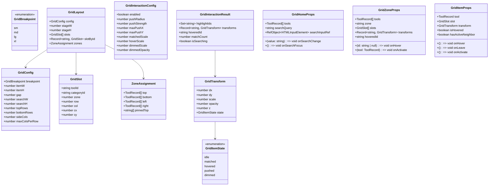
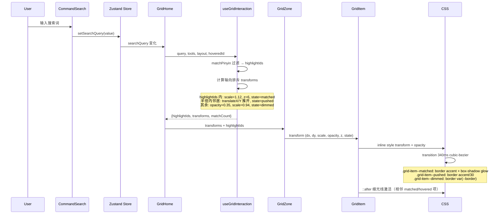
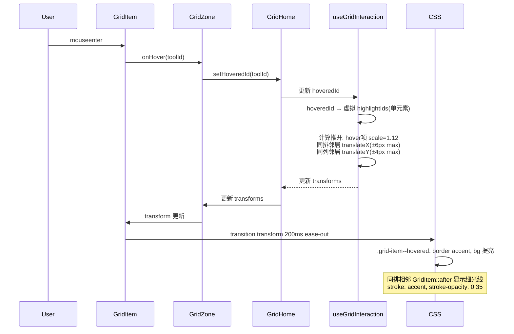
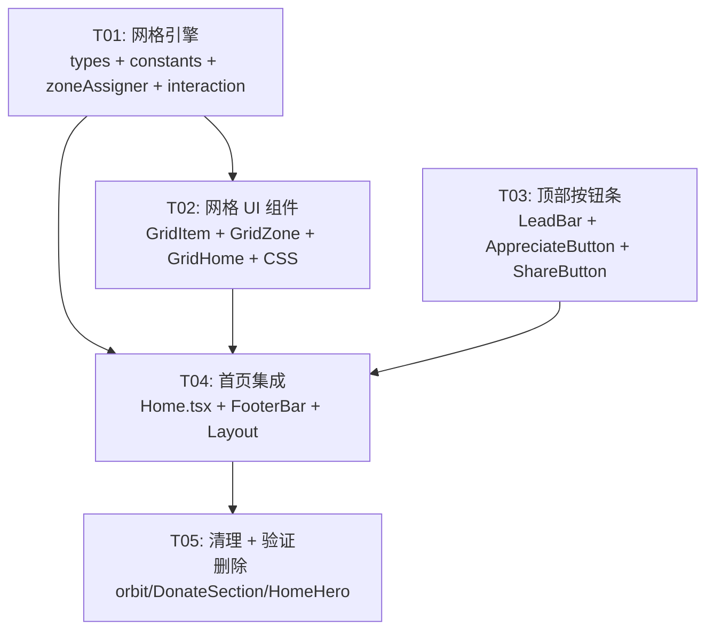

# 首页网格布局改造 — 系统设计文档

> 版本：v3.0-grid  
> 日期：2026-08-08  
> 作者：Bob（架构师）  
> 前置：PRD（15 条已锁定需求，team-lead 提供）

---

## 目录

1. [Part A：系统设计](#part-a系统设计)
   - [1. 实现方案](#1-实现方案)
   - [2. 文件清单](#2-文件清单)
   - [3. 数据结构与接口](#3-数据结构与接口)
   - [4. 程序调用流程](#4-程序调用流程)
   - [5. 待明确事项](#5-待明确事项)
2. [Part B：任务拆解](#part-b任务拆解)
   - [6. 依赖包列表](#6-依赖包列表)
   - [7. 任务列表](#7-任务列表)
   - [8. 共享知识](#8-共享知识)
   - [9. 任务依赖图](#9-任务依赖图)

---

## Part A：系统设计

### 1. 实现方案

#### 1.1 核心技术挑战

| 挑战 | 分析 |
|------|------|
| **66 工具一屏展示** | 1920×1080 可用面积约 1880×900px，每个工具卡片 84×76px + 6px gap，四区网格天然容纳 200+ 格位，容量充裕 |
| **邻居推开在网格中的实现** | 轨道排斥是径向的（`repulsion.ts`），网格排斥是**轴向的**：同排相邻卡片沿 X 轴推开，同列沿 Y 轴推开，距离衰减公式可复用，但方向计算需重写 |
| **细光线在网格中的呈现** | 轨道细光线沿椭圆弧连接，网格细光线是**水平/垂直短线**连接同排相邻卡片，只在 hover/search 时激活 |
| **一屏不滚动** | 使用 `100vh` 或 `100dvh` 容器 + `overflow: hidden`，内容区 flex 分配空间 |
| **性能（66 DOM 动画）** | 只改 `transform` / `opacity` / `stroke-opacity`，will-change 仅在交互期挂载，`prefers-reduced-motion` 兜底 |

#### 1.2 框架选型

| 层面 | 选型 | 理由 |
|------|------|------|
| 布局 | CSS Grid + Flexbox（Tailwind） | 零依赖，已有 Tailwind 3 |
| 状态 | Zustand（现有 store） | 不改动 |
| 动效 | CSS transition + inline style transform | 只触发合成层，不触发 layout |
| 搜索 | 复用 `CommandSearch` 组件 | 不改内部逻辑（约束 #6） |
| 图标 | lucide-react（现有） | 不改动 |

#### 1.3 网格布局设计方案

##### 整体结构

```
┌──────────────────────────────────────────────┐
│  LeadBar: [社区留言] [分享]   ← fixed top-right│
├──────────────────────────────────────────────┤
│              TOP ZONE（上区）                  │
│  ┌─────────┬─────────┬─────┬─────┬─────────┐ │
│  │ QR 生成 │ QR 识别 │ ... │ ... │ ...     │ │ ← Row 0（置顶行）
│  ├─────────┼─────────┼─────┼─────┼─────────┤ │
│  │ 工具 3  │ 工具 4  │ ... │ ... │ ...     │ │ ← Row 1~N（日常必备）
│  └─────────┴─────────┴─────┴─────┴─────────┘ │
├──────────────┬──────────────┬────────────────┤
│  LEFT ZONE   │              │  RIGHT ZONE    │
│  ┌────┬────┐ │   SEARCH     │  ┌────┬────┐   │
│  │理财│健康│ │     BOX      │  │趣味│趣味│   │
│  ├────┼────┤ │  ┌────────┐  │  ├────┼────┤   │
│  │理财│健康│ │  │搜索工具 │  │  │趣味│趣味│   │
│  ├────┼────┤ │  └────────┘  │  ├────┼────┤   │
│  │... │... │ │              │  │... │... │   │
│  └────┴────┘ │              │  └────┴────┘   │
│  理财+健康   │              │   趣味娱乐     │
├──────────────┴──────────────┴────────────────┤
│            BOTTOM ZONE（下区）                 │
│  ┌────┬────┬────┬────┬────┬────┬────┬────┐  │
│  │图片│图片│图片│图片│图片│图片│图片│图片│  │
│  ├────┼────┼────┼────┼────┼────┼────┼────┤  │
│  │... │... │... │... │... │... │... │... │  │
│  └────┴────┴────┴────┴────┴────┴────┴────┘  │
│              图片与PDF                       │
├──────────────────────────────────────────────┤
│  FOOTER: 访问时长 + 访问数量 | 双行 slogan    │
└──────────────────────────────────────────────┘
```

##### 工具分区规则

| 区域 | 分类 | 数量 | 说明 |
|------|------|------|------|
| **Top（上）** | everyday（日常必备） | 27 | 含 Row 0 固定置顶 QR 生成 / QR 识别 |
| **Left（左）** | finance（理财）+ health（健康） | 6 + 7 = 13 | 纵向排列，2~3 列 |
| **Right（右）** | fun（趣味娱乐） | 11 | 纵向排列，2~3 列 |
| **Bottom（下）** | image（图片与PDF） | 15 | 横向排列 |

> 合计：27 + 13 + 11 + 15 = **66** ✓

##### 各断点网格参数

| 断点 | 视口宽 | 搜索框宽 | 卡片尺寸 | 卡片 gap | Top 行数 | Bot 行数 | L/R 列数 | 降级 |
|------|--------|---------|---------|---------|---------|---------|---------|------|
| **xl** | ≥1280 | 520px | 84×76 | 6px | 3 | 3 | 3 | — |
| **lg** | ≥1024 | 440px | 76×68 | 5px | 3 | 2 | 2 | — |
| **md** | ≥768 | 360px | 68×60 | 4px | 2 | 2 | 2 | — |
| **sm** | <768 | 100% | 全宽列表 | 4px | — | — | — | 堆叠：搜索→全部工具网格（复用 ToolGrid） |

> **sm 降级方案**：<768px 时整个四区布局退化为纵向堆叠——搜索框在上、下方为 `ToolGrid` 全宽卡片列表（与当前 OrbitFallback → HomeHero 的降级路径一致，但展示从 HomeHero 切换为 ToolGrid 紧凑视图）。此方案保证小屏可用性，且全在一屏内。

##### 邻居推开 + 细光线 实现方案（选最优方案 A）

| 方案 | 描述 | 优劣 |
|------|------|------|
| **A：CSS transform + pseudo-element 光线** | hover/匹配卡片 `scale(1.12)`，同排相邻卡片 `translateX(±6px)`，同列相邻 `translateY(±4px)`；细光线用 `::before`/`::after` 伪元素绘制相邻卡片间的水平/垂直线段 | ✅ 纯 CSS 驱动，GPU 合成，零 JS 帧循环<br>✅ 与现有 orbit 排斥内核思路一致，但改用 CSS 实现<br>⚠️ 伪元素光线需精确计算偏移位置 |
| B：JS rAF 循环 | 每帧计算所有卡片 transform | ❌ 66 个 DOM 的 rAF 开销大，违反性能红线 |
| C：CSS Grid gap 动画 | 通过 grid-gap 变化推开 | ❌ grid-gap 变化触发全局 layout，违反性能红线 |

**选择方案 A**。卡片使用 `absolute` 定位（由 GridZone 计算 x/y），transform 驱动所有位移和缩放，CSS transition 控制动画曲线。

#### 1.4 repulsion.ts 可复用分析

| 模块 | 是否复用 | 方式 |
|------|---------|------|
| `falloffValue()` | ✅ 复用 | 距离衰减公式完全适用，从 `repulsion.ts` 提取到 `src/lib/grid/interaction.ts`（独立副本，不改 orbit 源文件） |
| `computeRepulsion()` | ❌ 不适用 | 径向排斥 → 轴向排斥，方向计算逻辑完全不同 |
| `RepulsionConfig` 结构 | ⚠️ 参考 | 新定义 `GridInteractionConfig`，结构类似但参数不同 |
| `useOrbitHighlight` 匹配口径 | ✅ 复用 | `matchPinyin` 搜索匹配逻辑直接复用 |

### 2. 文件清单

#### 2.1 删除（整个目录或单文件）

```
src/lib/orbit/                          # 整个目录（types.ts, orbitConstants.ts,
                                        #   ellipse.ts, layout.ts, repulsion.ts + __tests__/）
src/components/orbit/                   # 整个目录（ToolOrbit.tsx, OrbitItem.tsx,
                                        #   OrbitCenter.tsx, OrbitFallback.tsx,
                                        #   OrbitRingsLayer.tsx, OrbitConnections.tsx + __tests__/）
src/hooks/useOrbitLayout.ts             # orbit 专用 hook
src/hooks/useOrbitHighlight.ts          # orbit 专用 hook（匹配口径在新 hook 中复用）
src/components/DonateSection.tsx        # 赞赏改为按钮形式
src/components/HomeHero.tsx             # 被 GridHome 替代（确认无其他引用后删除）
```

#### 2.2 修改

```
src/pages/Home.tsx                      # 完全重写：orbit → 网格布局
src/components/FooterBar.tsx            # slogan 改为双行，统计移到底部居中
src/components/Layout.tsx               # ShareButton 替换为 LeadBar
src/components/ShareButton.tsx          # 视觉强化（或合并进 LeadBar）
src/index.css                           # 删除所有 orbit-* 样式，新增 grid-* 样式
```

#### 2.3 新建

```
src/lib/grid/types.ts                   # 网格布局类型定义
src/lib/grid/gridConstants.ts           # 网格断点/尺寸常量
src/lib/grid/zoneAssigner.ts            # 66 工具 → 四区分区逻辑
src/lib/grid/interaction.ts             # 网格排斥（轴向）+ 距离衰减
src/hooks/useGridLayout.ts              # 网格布局计算 hook（useMemo 封装）
src/hooks/useGridInteraction.ts         # 搜索匹配 + hover 推开 + 光线激活
src/components/GridHome.tsx             # 网格首页主组件（组装四区 + 搜索 + 页脚）
src/components/GridZone.tsx             # 单区网格组件（渲染一批 GridItem）
src/components/GridItem.tsx             # 单个工具卡片（图标 + 名称 + 状态）
src/components/LeadBar.tsx              # 顶部固定按钮条（分享 + 社区留言）
src/components/AppreciateButton.tsx     # 赞赏按钮（悬停弹出微信+支付宝二维码）
```

### 3. 数据结构与接口



### 4. 程序调用流程

#### 4.1 搜索输入 → 过滤匹配 → 高亮发光 → 邻居微退 → 细光线激活



#### 4.2 鼠标悬停卡片 → 放大 + 邻居推开 + 细光线



### 5. 待明确事项

| # | 事项 | 当前假设 | 影响 |
|---|------|---------|------|
| 1 | 四区工具分配是否严格按分类？ | 是：everyday→Top, finance+health→Left, fun→Right, image→Bottom | 如果用户希望混排或自定义，`zoneAssigner.ts` 需要支持可配置规则 |
| 2 | sm 降级时是否保留「邻居推开」效果？ | 不保留，降级为纯 ToolGrid 列表 | 小屏性能优先级 > 动画效果 |
| 3 | ShareButton 是独立文件改造还是合并进 LeadBar？ | 保持 ShareButton 独立，LeadBar 只做容器包装 | 改动面最小，ShareButton 自身逻辑（QR 生成、复制链接）不碰 |
| 4 | 细光线的色相来源？ | 取发送方分类 hue（复用 orbitConstants `CATEGORY_CHIP_HUE`），CSS 变量仍然可用 | 需要把 `CATEGORY_CHIP_HUE` 从 orbitConstants 迁移到共享常量 |
| 5 | FooterBar 导航链接（首页/社区/关于）是否保留在原位？ | 保留导航链接在 Footer，但「今日/本周时长」和「访问次数」移到 Footer 最下方居中 | 需求 #8 明确「页面最下方居中」 |

---

## Part B：任务拆解

### 6. 依赖包列表

```
无新增 npm 依赖（约束 #1：Tailwind/CSS 变量解决全部样式）
现有依赖不变：
- react@^18.3.0
- react-dom@^18.3.0
- react-router-dom@^6.x
- zustand@^4.x
- lucide-react@^0.x
- qrcode@^1.x
- tailwindcss@^3.x
- vite@^6.x
- typescript@^5.x
```

### 7. 任务列表（按实现顺序）

---

#### T01：网格引擎（类型 + 常量 + 分区逻辑 + 交互计算）

| 字段 | 内容 |
|------|------|
| **Task ID** | T01 |
| **Task Name** | 网格引擎：类型定义、断点常量、四区分区、交互计算 |
| **Source Files** | `src/lib/grid/types.ts`（新建）<br>`src/lib/grid/gridConstants.ts`（新建）<br>`src/lib/grid/zoneAssigner.ts`（新建）<br>`src/lib/grid/interaction.ts`（新建）<br>`src/hooks/useGridLayout.ts`（新建）<br>`src/hooks/useGridInteraction.ts`（新建） |
| **Dependencies** | 无 |
| **Priority** | P0 |
| **描述** | 1. `types.ts`：定义 `GridBreakpoint`、`GridConfig`、`GridSlot`、`ZoneAssignment`、`GridLayout`、`GridTransform`、`GridItemState`、`GridInteractionConfig`、`GridInteractionResult` 等类型<br>2. `gridConstants.ts`：定义四个断点的 `GridConfig`（卡片尺寸、gap、搜索框尺寸、行列数），`GRID_Z`（z 轴预算 ≤20），`CATEGORY_CHIP_HUE`（从 orbitConstants 迁移），动效 token（`--grid-dur-*` CSS 变量配对常量）<br>3. `zoneAssigner.ts`：`assignZones(tools)` 函数，按分类把 66 个工具分配到 top/bottom/left/right 四个区，QR 生成/QR 识别固定到 top[0] 和 top[1]<br>4. `interaction.ts`：`computeGridRepulsion(slots, highlightIds, hoveredId, config)` 函数，轴向排斥计算（同排 X 推开、同列 Y 推开），复用 `falloffValue` 距离衰减<br>5. `useGridLayout.ts`：`useGridLayout(tools, stageWidth, stageHeight)` → `GridLayout`，useMemo 封装布局计算<br>6. `useGridInteraction.ts`：`useGridInteraction(tools, layout, query, hoveredId, reducedMotion)` → `GridInteractionResult`，复用 `matchPinyin` 匹配口径 |

---

#### T02：网格 UI 组件（GridItem + GridZone + GridHome）+ CSS

| 字段 | 内容 |
|------|------|
| **Task ID** | T02 |
| **Task Name** | 网格 UI 组件：卡片、分区、首页框架 + index.css 更新 |
| **Source Files** | `src/components/GridItem.tsx`（新建）<br>`src/components/GridZone.tsx`（新建）<br>`src/components/GridHome.tsx`（新建）<br>`src/index.css`（修改） |
| **Dependencies** | T01 |
| **Priority** | P0 |
| **描述** | 1. `GridItem.tsx`：单个工具卡片，`absolute` 定位由 `slot.cx/cy` + `transform(dx,dy)` 决定。渲染图标（复用 `getToolIcon`）+ 名称文字（11px/两行）。状态 class：`idle`/`matched`/`hovered`/`pushed`/`dimmed`。`::after` 伪元素承载同排相邻细光线<br>2. `GridZone.tsx`：单个区域（top/bottom 横向 grid，left/right 纵向 grid）。接收 `tools`、`slots`、`transforms`。计算子 GridItem 定位。渲染区域内细光线 SVG 层<br>3. `GridHome.tsx`：首页主组件。组合：顶部品牌条（复用现有 sticky bar）→ LeadBar 占位 → 搜索框居中（复用 `CommandSearch`）→ 四区 GridZone → Footer 统计+slogan。使用 `useStageMetrics`（复用现有 hook）获取容器尺寸，驱动 `useGridLayout` + `useGridInteraction`<br>4. `index.css`：删除所有 `orbit-*` 样式（约 200 行），新增 `grid-*` 样式（卡片状态、细光线、动效 token CSS 变量）。保留 `prefers-reduced-motion` 规则并扩展覆盖网格动画 |

---

#### T03：顶部按钮条（LeadBar + AppreciateButton + ShareButton 强化）

| 字段 | 内容 |
|------|------|
| **Task ID** | T03 |
| **Task Name** | 顶部按钮条：分享强化 + 社区留言 + 赞赏按钮 |
| **Source Files** | `src/components/LeadBar.tsx`（新建）<br>`src/components/AppreciateButton.tsx`（新建）<br>`src/components/ShareButton.tsx`（修改） |
| **Dependencies** | 无（纯 UI 组件，可与 T01/T02 并行） |
| **Priority** | P0 |
| **描述** | 1. `LeadBar.tsx`：fixed top-right 容器，z-[350]，包含 ShareButton + 社区留言按钮。两个按钮并排，统一样式（圆角胶囊、玻璃态、相同尺寸）。社区留言按钮点击导航到 `/community`<br>2. `AppreciateButton.tsx`：固定按钮（ThumbsUp 图标 + "赞赏"），位置在右下或右上（与 LeadBar 协调）。hover 触发 popover 浮层（z-[360]），展示微信赞赏码 + 支付宝赞赏码（两张图并排，复用 `/wechat-donate.jpg` 和 `/alipay-donate.jpg`）。使用 `useFocusTrap` 保证无障碍<br>3. `ShareButton.tsx`：视觉强化——更大尺寸（min-h-[48px]）、更明显的 accent 色边框、hover 时微发光。保持现有 QR 生成/复制链接逻辑不变 |

---

#### T04：首页集成 + Footer 改造

| 字段 | 内容 |
|------|------|
| **Task ID** | T04 |
| **Task Name** | Home.tsx 重写 + FooterBar 改造 + Layout.tsx 更新 |
| **Source Files** | `src/pages/Home.tsx`（重写）<br>`src/components/FooterBar.tsx`（修改）<br>`src/components/Layout.tsx`（修改） |
| **Dependencies** | T01, T02, T03 |
| **Priority** | P0 |
| **描述** | 1. `Home.tsx`：完全重写。删除所有 orbit 相关 import（ToolOrbit、OrbitFallback、ORBIT_FALLBACK_MAX_WIDTH、DonateSection）。新增 GridHome 替换英雄区。删除「全部工具」模块（下方 ToolGrid 区域）。删除 DonateSection 引用。保留 Ctrl+K 搜索、URL 同步（category/q 参数）、OnboardingModal(z-50)。保留分类标签 sticky 行（如果需要）。`<640px` 降级直接使用 GridHome 的 sm 模式（内部自适应）<br>2. `FooterBar.tsx`：slogan 替换为双行——上行「普通日常工具箱 · 所有工具永久免费 · 无需注册 · 工具数据本地处理」；下行「一个网页，解决你的问题」。访问量统计（visitCount）移到 Footer 最下方居中展示，与使用时长（todayMinutes/weekMinutes）并排。「访问时长」「访问数量」两个统计放在页面最下方居中。保留现有导航链接和 ThemeToggle<br>3. `Layout.tsx`：将 `<ShareButton />` 替换为 `<LeadBar />`，保留 ShareButton 作为 LeadBar 的子组件。Layout 其余结构不变 |

---

#### T05：清理 + 回归验证

| 字段 | 内容 |
|------|------|
| **Task ID** | T05 |
| **Task Name** | 删除 orbit 模块 + DonateSection + 最终集成验证 |
| **Source Files** | 删除：`src/lib/orbit/`（全部）<br>删除：`src/components/orbit/`（全部）<br>删除：`src/hooks/useOrbitLayout.ts`<br>删除：`src/hooks/useOrbitHighlight.ts`<br>删除：`src/components/DonateSection.tsx`<br>删除：`src/components/HomeHero.tsx`（确认无其他引用）<br>修改：`src/index.css`（清理残留 orbit 引用） |
| **Dependencies** | T04 |
| **Priority** | P1 |
| **描述** | 1. 删除所有 orbit 相关文件和目录<br>2. 删除 DonateSection.tsx（已被 AppreciateButton 替代）<br>3. 检查 HomeHero.tsx 是否还有其他引用（OrbitFallback 引用它，OrbitFallback 已删除 → 应无引用；检查测试文件）<br>4. 检查 index.css 中是否还有未清理的 orbit 样式<br>5. 验证：`npm run build` 无报错，`npm run dev` 首页正常渲染<br>6. 验证：留言板（/community）页面不受影响，Footer 统计正常<br>7. 验证：Ctrl+K 搜索、URL 参数同步、OnboardingModal 均正常工作 |

### 8. 共享知识

```
# 坐标系约定
- 网格使用 CSS 坐标系：原点在左上角，+x 向右，+y 向下
- GridSlot.cx/cy = 卡片中心相对舞台原点的像素坐标
- GridTransform.dx/dy = 排斥位移增量（叠加到 cx/cy 上）

# z 轴预算（全站统一）
- GridItem idle: 1
- GridItem pushed: 2
- GridItem hovered: 4
- GridItem matched: 6
- 搜索框 dropdown: 10
- GridZone 细光线 SVG: 0（pointer-events: none）
- 分类标签 sticky 行: z-30
- 顶部品牌条 sticky: z-40
- OnboardingModal: z-50
- LeadBar: z-[350]
- ShareButton panel: z-[400]
- AppreciateButton popover: z-[360]

# CSS 变量（index.css 与 gridConstants.ts 成对镜像）
- --grid-dur-move: 340ms（transform transition）
- --grid-dur-fade: 200ms（opacity transition）
- --grid-ease-move: cubic-bezier(0.34, 1.24, 0.44, 1)
- --grid-ease-fade: ease-out
- --grid-line-base-alpha: 0.15（细光线常态透明度）
- --grid-line-active-alpha: 0.5（细光线激活透明度）
- --grid-glow-radius: 18px（匹配卡片发光扩散）

# 性能铁律
- 只改 transform / opacity / stroke-opacity
- will-change 仅在 searchQuery !== '' 或 hoveredId !== null 时挂载
- prefers-reduced-motion: reduce → 所有动画 0.01ms，位移归零

# 搜索匹配口径（三处必须一致）
- matchPinyin(`${tool.name} ${tool.description} ${tool.id}`, query.trim())
- 三处：CommandSearch 下拉 / useGridInteraction 高亮 / Home 过滤（如保留）

# 图标映射
- 复用 ToolGrid.tsx 的 iconMap 和 getToolIcon()，不新建映射

# 分类色相
- 从 orbitConstants.ts 的 CATEGORY_CHIP_HUE 迁移到 gridConstants.ts
- CSS 变量 --orbit-cat-*-h 重命名为 --grid-cat-*-h（或保留原名以避免影响社区/其他页面）
- 实际决策：保留 CSS 变量名不变（--orbit-cat-*-h），因为其他组件可能引用；
  只把 JS 端常量从 orbitConstants 迁移到 gridConstants
```

### 9. 任务依赖图



> **并行提示**：T01 和 T03 可并行开发（T03 是纯 UI 组件，不依赖网格引擎）。T02 依赖 T01。T04 依赖 T01+T02+T03。T05 依赖 T04。

---

*文档结束*
