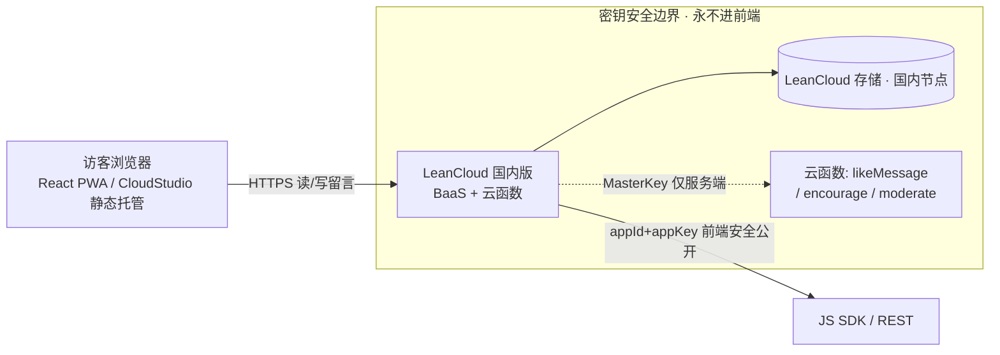
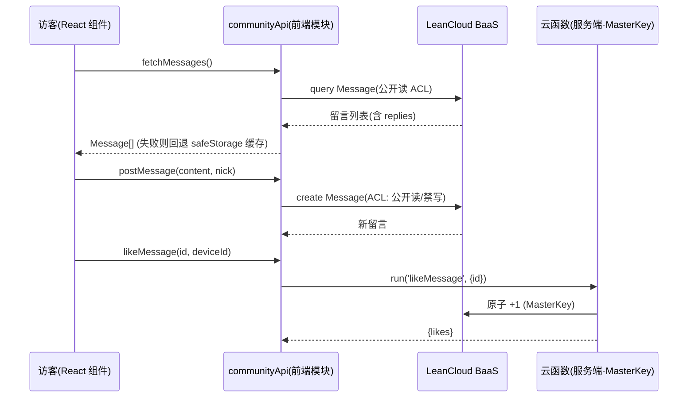

# 云端共享留言板 — 技术方案对比与选型建议

> **项目**：普通日常工具箱（daily-toolkit）
> **文档性质**：调研 + 架构设计（**不含实现代码**，仅产出方案供站长拍板）
> **作者**：架构师 高见远（Bob）
> **约束回顾**：零/极低成本 · 不想搞运维 · 国内用户为主 · 安全敏感（密钥绝不进前端）· 本体保持纯前端，后端只用 Serverless / BaaS 免费层

---

## 0. 背景与现状盘点（含已有前置工作，避免重复踩坑）

| 项 | 现状 |
|----|------|
| 技术栈 | 纯前端 PWA：React18 + TS + Vite + Tailwind + Zustand，HashRouter，66 工具，**零后端** |
| 当前部署 | CloudStudio 静态托管（读 `dist/`），线上 `https://6c9131a380b24cd08741384565831c9b.bj9.agentos-app.net` |
| 当前留言板 | `src/pages/Community.tsx`，数据层 `safeStorage`（localStorage，key=`toolbox_community_messages`），**纯本机，其他人看不到** |
| 用户意图 | 改为**公开共享云端留言板**：任何访客可读 + 可匿名发布 + 持久化 + 点赞/回复/鼓励互动保留 |

**⚠️ 重要发现（来自仓库盘点，避免重复造轮子 / 踩旧坑）**：
仓库里其实残留了早期「后端草稿」——
- `supabase-migration.sql`（定义了 `messages` + `replies` 两张表）
- `.env.example`（`VITE_SUPABASE_URL` / `VITE_SUPABASE_ANON_KEY`，注释提到 Cloudflare Pages）
- 对话记录 `对话记录整理.md` 里提到的 `d1-schema.sql` 与 `/functions/api/messages`（CRUD+点赞+回复+鼓励）、`/api/stats`

但这些在对话记录中已被明确标注为 **「与当前代码不符 / 后端已清理 / 改为纯静态部署」** —— 即**之前的 Supabase / Cloudflare D1 思路并未落地，当前项目是纯静态零后端**。

**结论**：本次不是从零开始，而是从选型重新决策。之前 Supabase 草稿缺 RLS 策略、Cloudflare D1 草稿国内访问不稳，本次必须正视这些教训，并严格尊重「零运维 / 零成本 / 密钥不暴露」三道红线。

---

## 1. 需求本质拆解

目标 = **公共可读 + 公共写入 + 持久化 + 互动**。对后端意味着什么：

| 能力 | 后端含义 | 风险等级 |
|------|---------|---------|
| **R 公共可读** | 无需登录即可拉取留言列表 → 服务端查询 | 低 |
| **C 公共写入** | 任何访客匿名提交 → **最危险的部分（未鉴权写）** | **高** |
| **U/D 互动/管理** | 点赞计数自增、回复追加；删除/隐藏应是**管理行为**（不能让匿名用户删别人留言） | 中 |
| **持久化** | 结构化库（SQL/NoSQL），长期留存 | 低 |
| **防滥用** | 限流（同浏览器/IP 频率）、内容长度/敏感词、垃圾信息、CORS/CSRF | **高** |

### 🔴 安全红线（站长明确强调）
**禁止「前端暴露写权限密钥」反模式**：前端打包产物里不能出现 D1 token / Supabase `service_role` key / LeanCloud `MasterKey` 之类能直接改/删全库的凭据（任何人都能从 JS bundle 提取并拖库）。

正确做法只有两类：
- **(a) BaaS 模式**：前端只用「公开匿名 key」，`写权限由服务端规则（ACL / RLS）强制`；敏感管理操作走「云函数 / Edge Function」（服务端持 MasterKey）。
- **(b) Serverless 代理模式**：Worker / 云函数持有数据库绑定或密钥，前端只调其公共 HTTPS 接口。

> 下面 A/B/C 三种方案都属于正模式；D 用 GitHub OAuth（也不暴露令牌）；只有「E 自建 + 前端硬编码密钥」和「前端直接拿 admin key 写库」才是反模式。

---

## 2. 候选方案对比（可行性评估）

### A. Cloudflare Workers + D1（或 KV）
- **架构**：Worker 持有 D1 绑定（服务端注入，无密钥进前端）；前端只 `fetch` Worker 公共接口；Worker 内做校验 + 限流 + 写库。
- **成本**：✅ 免费额度充足（Workers 10 万次请求/天；D1 5GB/500 万读/10 万写每天；KV 免费读）。
- **国内访问**：⚠️ **最大短板** —— Cloudflare 在大陆无官方节点，流量常绕港/日/新，部分网络下慢、偶发不可达或被墙，与「国内访问延迟要能接受」直接冲突。
- **运维**：✅ 极低（Serverless，无需服务器/数据库运维）。
- **密钥安全**：✅✅ **最佳** —— 前端零密钥，D1 通过 `env.DB` 绑定注入 Worker，令牌仅服务端。
- **匿名**：✅ 支持。
- **防滥用**：需在 Worker 内自建（KV/Durable Object 计数器做限流、内容校验、敏感词）。
- **备案**：否（海外）。
- **集成**：前端 `fetch()` 即可，轻量。
- ** verdict**：技术上最干净、最贴合「密钥不暴露 + 零运维 + 零成本」，**但国内访问稳定性是硬伤**。若站长能接受（或已有可稳定访问的 Cloudflare 域名/代理），强烈推荐；否则不建议首选。
- 📌 注：这本质是**复活之前被弃用的 Pages Functions + D1 思路**，且它恰好是「密钥最干净」的方案。

### B. LeanCloud（国内 BaaS）★ 推荐重点
- **架构**：前端用 JS SDK（`appId` + `appKey`，安全公开）；类权限设「未登录可查找/创建，不可更新/删除」；每条对象 `ACL = 公开读 / 禁写`；点赞/鼓励/管理走「云函数」（服务端持 MasterKey 原子自增）。
- **成本**：⚠️ 国内版「开发版」**免费**（有请求/存储/并发限制）；生产流量增长可能需升级标准版（价格低，个人可承受）。基本零成本，长期有小幅升级可能。
- **国内访问**：✅ **国内节点，延迟低且稳定**，最契合「国内用户为主（河南济源）」。
- **运维**：✅ 低（BaaS 托管，无需自建库）。
- **密钥安全**：✅ `appId`/`appKey` 可公开（等同 Supabase anon key），`MasterKey` 仅服务端/云函数，绝不进前端。满足红线。
- **匿名**：✅ 支持（无需登录即可 create）。
- **防滥用**：ACL 天然防「删/改他人」；云函数内可做限流 + 校验；内容审核需自建敏感词或接第三方（付费）。
- **备案**：否（默认 API 域名调用无需备案；仅自定义 API 域名才需备案）。⚠️ 需**实名认证**账号。
- **集成**：`leancloud-storage` SDK，React 直接 `import` 调用；或 REST。改动小。
- ** verdict**：**最契合「国内 + 零成本 + 零运维 + 密钥不暴露」四大约束，推荐首选**。

### C. Supabase（海外 Postgres + RLS）
- **架构**：前端 `supabase-js`（URL + anon key，安全公开）；RLS 策略：anon 可 `SELECT`、可 `INSERT`（带 CHECK）、不可 `UPDATE`/`DELETE`；点赞/管理走 RPC（security definer）或 Edge Function。
- **成本**：✅ Free 计划（500MB 库、2GB 带宽/月、5 万 MAU）对小站够用。
- **国内访问**：⚠️ 托管于 AWS（美/欧/亚太），大陆访问 **100–300ms+**，偶发抖动，不如 B。
- **运维**：✅ 低。
- **密钥安全**：✅ anon key 公开，`service_role` 仅服务端；RLS 强制。满足红线。
- **匿名**：✅。
- **防滥用**：RLS 防越权；限流/审核需自建；有 **Realtime 可实时刷新**（体验好）。
- **备案**：否。
- **集成**：`supabase-js` SDK；仓库已有 `supabase-migration.sql` 草稿可复用（**但缺 RLS 策略，必须补**）。
- ** verdict**：海外、国内延迟是短板；若站长能接受海外 / 偏好开源 Postgres，可作备选。⚠️ 现有草稿未定义 RLS，直接上线会被匿名改/删全库，**必须补策略**。

### D. GitHub Issues / giscus 等第三方评论
- **架构**：giscus 用 GitHub Discussions/Issues 作存储，前端嵌入脚本。
- **成本**：✅ 免费。
- **国内访问**：一般（GitHub 偶发卡/慢）。
- **运维**：✅ 极低。
- **密钥安全**：✅ 用 GitHub OAuth，不暴露 PAT/令牌（与「令牌泄露担忧」不冲突，但心理上有顾虑）。
- **匿名**：❌ **评论必须 GitHub 登录（OAuth）**，与「任何访客都能留言」的低门槛冲突。
- **防滥用**：依赖 GitHub 社区规范 + 站长审核 Issues。
- ** verdict**：不符合「纯匿名访客即发」诉求；且站长刚经历 GitHub 令牌担忧，心理接受度低。**不推荐**，除非接受「必须登录 GitHub」。

### E. 自建服务器 + 数据库
- **成本**：❌ 需买云服务器/域名/可能备案，持续付费。
- **运维**：❌ 高（系统/数据库/安全补丁、备份、监控）。
- ** verdict**：直接违反「零成本 / 零运维」硬约束，**列为否决项，不入选型**。

---

## 3. 各维度对比表

| 维度 | A. CF Workers+D1 | B. LeanCloud 国内版 | C. Supabase | D. giscus | E. 自建服务器 |
|------|:---:|:---:|:---:|:---:|:---:|
| **成本** | 免费额度充足 ✅ | 开发版免费 ⚠️可能升级 | Free 计划 ✅ | 免费 ✅ | 付费+持续 ❌ |
| **国内访问** | 不稳定/偶发被墙 ⚠️ | 快且稳定 ✅ | 一般 100–300ms ⚠️ | 一般/偶发卡 | 取决于部署 |
| **是否需要登录** | 否（匿名）✅ | 否（匿名）✅ | 否（匿名）✅ | 是（GitHub）❌ | 自定 |
| **匿名可行性** | ✅ | ✅ | ✅ | ❌ | ✅ |
| **运维负担** | 极低 ✅ | 低 ✅ | 低 ✅ | 极低 ✅ | 高 ❌ |
| **前端密钥暴露风险** | 无（服务端绑定）✅✅ | 低（仅 appKey，MasterKey 服务端）✅ | 低（仅 anon key，RLS 强制）✅ | 无 ✅ | 自定 ⚠️ |
| **防垃圾/滥用** | 需 Worker 内自建 | ACL+云函数+限流 | RLS+需自建限流 | GitHub 社区审核 | 自定 |
| **与 React 集成** | fetch 简单 ✅ | JS SDK / REST ✅ | supabase-js ✅ | 脚本嵌入 | 自定 |
| **是否需要备案** | 否 | 否（默认 API 域名）⚠️实名 | 否 | 否 | 是 ❌ |
| **数据主权** | 海外 | 国内 ✅ | 海外 | GitHub | 自定 |
| **综合推荐度** | 备选 | **首选** | 第三备 | 不推荐 | 否决 |

---

## 4. 推荐方案 + 理由

### 🥇 首选：B. LeanCloud 国内版（BaaS + 云函数代理写）
**一句话理由**：在「国内快 + 零/极低成本 + 零运维 + 密钥不暴露」四大约束里，它是唯一四项全绿、且无短板的方案。

详细理由：
1. **国内访问**：国内节点，河南济源访客延迟低、稳定 —— 直接命中硬约束。
2. **零/极低成本**：开发版免费；即便未来升级标准版也是个人可承受的小额。
3. **零运维**：BaaS 托管，无需自建/维护数据库。
4. **密钥不暴露**：前端只持 `appId`/`appKey`（安全公开），`MasterKey` 仅存在于云函数服务端；类权限「未登录可查/可建、不可改/删」+ 每条 `ACL=公开读/禁写`，从服务端强制隔离写权限。
5. **匿名可行**：无需登录即可发布，保留「任何访客都能留言」的低门槛体验。
6. **集成轻**：`leancloud-storage` SDK 在 React 中直接调用，现有 `Community.tsx` 的 async 函数签名可无缝替换实现。

> ⚠️ 已知前提：需**实名认证**账号；长期使用若流量增长可能需小额付费升级（见第 6 节待确认事项）。

### 🥈 备选：A. Cloudflare Workers + D1（复活之前的 Pages Functions + D1 思路）
**一句话理由**：如果你能接受国内访问的偶尔不稳（或已有可稳定访问的 Cloudflare 域名/代理），它是「密钥最干净 + 完全免费 + 零运维」的极致方案，且复用既有 D1 schema 思路。

详细理由：
1. **密钥最干净**：前端零密钥，D1 通过 `env` 绑定注入 Worker，任何写权限凭据都不进前端 bundle。
2. **完全免费 + 零运维**：Serverless，额度充足。
3. **唯一短板是国内访问**：Cloudflare 在大陆无官方节点，部分网络慢/偶发不可达。这是它屈居备选而非首选的唯一原因。

### 🥉 第三备：C. Supabase（若站长坚持海外 / 偏好开源 Postgres）
- 国内延迟 100–300ms 是短板；仓库已有 `supabase-migration.sql` 可复用，但**必须补 RLS 策略**（现有草稿缺策略，直接上线会被匿名改/删）。有 Realtime 实时刷新，体验佳。

### 否决：E（自建）、不推荐：D（giscus，强制 GitHub 登录）

---

## 5. 前端集成草图（以首选 B 为例）

> 设计原则：**不动 `Community.tsx` 的组件逻辑**。现有代码注释已约定「函数签名保持 async / 返回 Promise，组件侧逻辑无需改动」。我们只需把 `src/pages/Community.tsx` 底部的 localStorage 实现（第 47–112 行）抽换为调用后端的 `communityApi` 模块，组件里 `fetchMessages/postMessage/...` 的调用方式不变。

### 5.1 数据模型映射

现有前端模型（`Community.tsx`）：
```ts
interface Reply { id; nickname; content; timestamp }
interface Message {
  id; nickname; content; timestamp;
  likes; liked_by: string[]; encourages; encouraged_by: string[];
  replies: Reply[];
}
```

云端存储建议（LeanCloud 类 / 或 Supabase 表，结构一致）：
- **Message 类**：`nickname`(TEXT)、`content`(TEXT ≤500)、`createdAt`(自动)、`likes`(Number,默认0)、`encourages`(Number,默认0)、`likedBy`(Array<deviceId>)、`encouragedBy`(Array<deviceId>)、`status`(TEXT 'published'|'hidden')、`type`(TEXT 可选 'share'|'suggestion'|'roast'|'encourage')
- **Reply 类**：`parent`(Pointer→Message)、`nickname`、`content`(≤300)、`createdAt`
- **deviceId**：每浏览器一个匿名设备 ID（存 `safeStorage` 的 `toolbox_device_id`），**替代 nickname 作为点赞去重键**（避免不同人昵称相同导致误 toggle）

### 5.2 接口契约（伪代码，非完整实现）

```ts
// src/lib/communityApi.ts  —— 替换 Community.tsx 内的 localStorage 函数
export interface ReplyDTO { id: string; nickname: string; content: string; timestamp: number; }
export interface MessageDTO {
  id: string; nickname: string; content: string; timestamp: number;
  likes: number; likedByMe: boolean;          // likedByMe = likedBy.includes(本机deviceId)
  encourages: number; encouragedByMe: boolean;
  replies: ReplyDTO[];                         // 由 API 层 join 后嵌套返回，保持 UI 不变
}
export interface ListResult { items: MessageDTO[]; nextCursor: string | null; offline?: boolean; }

export async function fetchMessages(opts?: { cursor?: string; limit?: number }): Promise<ListResult>;
export async function postMessage(input: { content: string; nickname?: string; type?: string }): Promise<MessageDTO>;
export async function postReply(parentId: string, input: { content: string; nickname?: string }): Promise<ReplyDTO>;
export async function likeMessage(id: string, liked: boolean): Promise<{ likes: number; likedByMe: boolean }>;
export async function encourageMessage(id: string, encouraged: boolean): Promise<{ encourages: number; encouragedByMe: boolean }>;
// 管理：仅站长，密码保护的云函数，前端不持任何 MasterKey
export async function moderateMessage(id: string, action: 'hide' | 'delete', adminPassword: string): Promise<boolean>;
```

### 5.3 鉴权方式
- **匿名**：无需登录。`nickname` 取自本地（现有随机昵称逻辑保留，可编辑，存 `safeStorage`）。
- **点赞/鼓励去重**：用本机 `deviceId`（非昵称）写入 `likedBy`/`encouragedBy` 数组，前端据 `deviceId` 计算 `likedByMe`，保证 toggle 准确且不串号。
- **管理操作**：`moderateMessage` 走密码保护的云函数（站长在隐藏管理页输入密码 → HTTPS 传到云函数 → 与 env 中的密钥比对后执行）。**密码是运行时人工输入，不写进前端 bundle**，不违反红线。

### 5.4 LeanCloud 安全配置要点（落地清单）
1. **类权限**（控制台）：Message / Reply 类 → 未登录用户：查找 ✅、创建 ✅、更新 ❌、删除 ❌。
2. **对象 ACL**：每条 `setPublicReadAccess(true)` + `setPublicWriteAccess(false)`。
3. **云函数**（服务端，持 MasterKey）：`likeMessage` / `encourageMessage` / `moderateMessage` 做原子自增 / 隐藏 / 删除，并内置限流 + 内容长度校验。
4. **前端初始化**：`AV.init({ appId, appKey })` —— **绝不传 masterKey**。

### 5.5 错误降级（后端不可用时的体验保护）
```ts
// 读取降级：后端挂了 → 回退 safeStorage 上次缓存，标记 offline 提示
try {
  return await leanFetchMessages();
} catch (e) {
  return { items: cacheFromSafeStorage(), nextCursor: null, offline: true };
}
// 发布降级：离线时先写 safeStorage 草稿，联网后自动重试同步
```
- 现有 `safeStorage` 保留为「缓存 + 离线草稿」层，不删除。
- PWA 的 Service Worker **不要缓存 BaaS/API 接口**（仅缓存静态产物），保证实时数据不被 SW 拦截。

### 5.6 行为变更点（需站长知悉）
| 现有行为 | 云端化后 | 说明 |
|---------|---------|------|
| 任何人可删**本机**任意留言 | 匿名**不可删**他人留言 | 删除改为管理行为，防滥用 |
| 点赞按 `nickname` 去重 | 改为按 `deviceId` 去重 | 多用户不串号 |
| 文案「仅本机可见」 | 改为「公开留言，所有人可见」 | UI 文案同步（Community.tsx 第 265 行） |
| 30s 轮询本地 | 30s 轮询云端（或 Supabase Realtime 推送） | 保留现有轮询逻辑 |

### 5.7 推荐架构图（Mermaid）



### 5.8 调用时序图（Mermaid）



---

## 6. 待确认事项（请站长拍板）

1. **访客留言是否需登录？**
   - 推荐：**纯匿名（默认随机昵称，可改）** —— 最低门槛，契合「任何访客都能留言」。
   - 备选：第三方登录（GitHub / 微信）防刷，但增加门槛、且站长对 GitHub 有顾虑。
2. **是否需要内容审核 / 防刷机制？**
   - 推荐：基础防刷（云函数限流 + 内容长度/敏感词黑名单 + 站长后台删/隐藏），零成本。
   - 是否要接**付费**内容安全（如腾讯云天御）？默认不做，需确认是否够用。
3. **对海外服务的接受度？**
   - 决定首选 B（国内）还是备选 A / 第三备 C（海外）。若坚持「全国内数据 + 低延迟」→ 选 B。
4. **LeanCloud 国内版前提确认**：需**实名认证**账号；开发版免费额度是否能满足长期？是否接受未来可能小额付费升级标准版？
5. **删除 / 管理权限归属**：推荐匿名不可删，站长通过 BaaS 控制台 或 密码保护的管理云函数 删/隐藏垃圾留言。是否接受「无前端删除按钮」？

---

## 7. 结论一句话

> **首选 LeanCloud 国内版**（国内快、免费开发版、零运维、ACL/MasterKey 隔离满足「密钥不暴露」、匿名可行）；**备选 Cloudflare Workers + D1**（密钥最干净、完全免费，但国内访问不稳）。两者都让前端**零密钥**，彻底规避「前端暴露写权限」反模式，且静态托管仍用 CloudStudio、不动现有 66 工具与 PWA 架构。请站长就第 6 节 5 项拍板后即可进入实现阶段。
